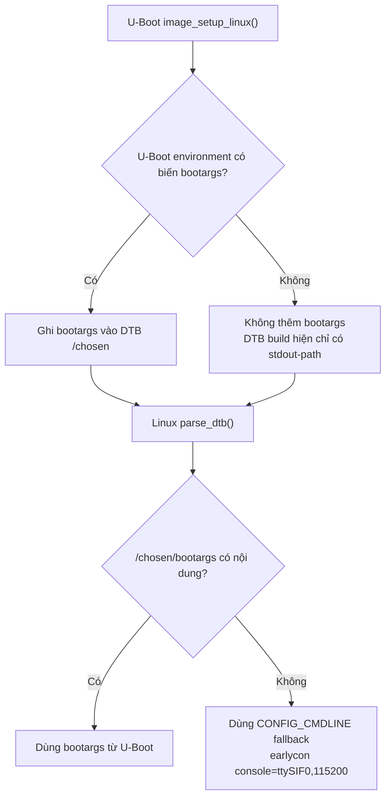

# Luồng khởi tạo Linux từ U-Boot trên Genesys2

Thông tin build đang được sử dụng:

- Kiến trúc: RISC-V 64-bit, S-mode, MMU Sv39.
- Linux: 6.19.6.
- Kernel FIT: `Image.gz`, load và entry tại `0x8280_0000`.
- Device Tree và `rootfs.cpio.gz`: U-Boot/LMB chọn địa chỉ runtime.
- OpenSBI: chạy resident ở M-mode.
- Linux đang tắt SMP (`# CONFIG_SMP is not set`), nên chỉ boot hart được Linux đưa online.

## Sơ đồ tổng thể

```mermaid
flowchart TD
    subgraph FW["OpenSBI — M-mode"]
        SBI["OpenSBI đã được SPL nạp trước U-Boot<br/>Vẫn resident khi U-Boot và Linux chạy S-mode<br/>Cung cấp timer, reset, IPI/HSM... qua SBI ECALL"]
    end

    subgraph UB["1. U-Boot chuẩn bị handoff"]
        U1["CONFIG_BOOTCOMMAND<br/>mmc info; fatload mmc 0:2; bootm"]
        U2["Parse FIT configuration: standard<br/>kernel-1 + fdt-1 + ramdisk-1<br/>Kiểm tra SHA-256"]
        U3["Giải nén Image.gz<br/>đến 0x8280_0000"]
        U4["LMB reserve/relocate<br/>DTB và rootfs.cpio.gz"]
        U5["image_setup_linux()<br/>image_setup_libfdt()"]
        U6["Cập nhật DTB runtime<br/>linux,initrd-start/end<br/>bootargs nếu U-Boot env tồn tại"]
        U7["board_quiesce_devices()<br/>dm_remove_devices_active()<br/>cleanup_before_linux()"]

        U1 --> U2 --> U3 --> U4 --> U5 --> U6 --> U7
    end

    subgraph ABI["2. ABI handoff U-Boot → Linux"]
        H["kernel(gd->arch.boot_hart, images->ft_addr)<br/><br/>PC = 0x8280_0000 (_start)<br/>a0 = boot hart ID<br/>a1 = địa chỉ vật lý DTB<br/>S-mode, MMU tắt"]
    end

    subgraph EARLY["3. RISC-V early entry — arch/riscv/kernel/head.S"]
        A1["_start → _start_kernel"]
        A2["Mask interrupt<br/>Enable time CSR access<br/>Load global pointer<br/>Disable trạng thái FPU/vector"]
        A3["Clear BSS<br/>Lưu boot_cpu_hartid = a0<br/>Thiết lập init_task và init stack<br/>Lấy DTB physical address từ a1"]
        A4["setup_vm(dtb_pa)<br/>Tạo early page tables"]
        A5["relocate_enable_mmu()<br/>trampoline_pg_dir → kernel page table<br/>Ghi SATP, bật MMU Sv39"]
        A6["Cài trap vector<br/>soc_early_init()"]
        A7["start_kernel()"]

        A1 --> A2 --> A3 --> A4 --> A5 --> A6 --> A7
    end

    subgraph GENERIC["4. Generic kernel initialization"]
        K1["smp_setup_processor_id()<br/>local_irq_disable()<br/>boot_cpu_init()<br/>In Linux banner"]
        K2["setup_arch(&command_line)"]
        K3["parse_dtb() và memblock<br/>sbi_init()<br/>paging_init()<br/>unflatten_device_tree()<br/>resources, ISA/hwcap, alternatives"]
        C{"DTB runtime có<br/>/chosen/bootargs?"}
        C1["Có: dùng bootargs từ U-Boot<br/>CONFIG_CMDLINE không override"]
        C2["Không: dùng CONFIG_CMDLINE fallback<br/>earlycon console=ttySIF0,115200"]
        K4["Parse kernel parameters<br/>MM/page allocator và slab<br/>VFS caches, scheduler, workqueues, RCU"]
        K5["init_IRQ() / PLIC<br/>tick, timer, timekeeping<br/>local_irq_enable()<br/>console_init()"]
        K6["rest_init()"]
        K7["Tạo PID 1: kernel_init<br/>Tạo PID 2: kthreadd<br/>Boot CPU vào idle loop"]

        K1 --> K2 --> K3 --> C
        C -- Có --> C1 --> K4
        C -- Không --> C2 --> K4
        K4 --> K5 --> K6 --> K7
    end

    subgraph INIT["5. PID 1: initcalls → initramfs → user space"]
        I1["kernel_init_freeable()<br/>Chờ kthreadd<br/>workqueue_init()"]
        I2["do_basic_setup()<br/>do_initcalls()"]
        I3["Initcall levels<br/>pure → core → postcore → arch → subsys<br/>→ fs → rootfs → device → late"]
        I4["Probe driver built-in<br/>SBI/PLIC, SiFive UART, Xilinx SPI<br/>mmc-spi, GPIO, LowRISC Ethernet..."]
        I5["rootfs_initcall(populate_rootfs)<br/>Giải nén rootfs.cpio.gz vào rootfs"]
        I6["wait_for_initramfs()<br/>console_on_rootfs()<br/>free_initmem()<br/>mark_readonly()"]
        I7["run_init_process('/init')"]
        I8["/init mount devtmpfs tại /dev<br/>Chuyển stdin/stdout/stderr sang /dev/console<br/>exec /sbin/init"]
        I9["/sbin/init đọc /etc/inittab<br/>Chạy rcS/services/getty ttySIF0<br/>User space sẵn sàng"]

        I1 --> I2 --> I3 --> I4 --> I5 --> I6 --> I7 --> I8 --> I9
    end

    U7 --> H --> A1
    A7 --> K1
    K7 --> I1

    K3 -. "SBI ECALL" .-> SBI
    SBI -. "Trả kết quả về S-mode" .-> K3

    classDef uboot fill:#d9eaf7,stroke:#2f75b5,color:#111;
    classDef handoff fill:#fce4d6,stroke:#c55a11,stroke-width:3px,color:#111;
    classDef early fill:#e4dfec,stroke:#7030a0,color:#111;
    classDef kernel fill:#e2f0d9,stroke:#548235,color:#111;
    classDef choice fill:#fff2cc,stroke:#bf9000,color:#111;
    classDef init fill:#f4cccc,stroke:#a64d79,color:#111;
    classDef firmware fill:#fff2cc,stroke:#d6b656,color:#111;

    class U1,U2,U3,U4,U5,U6,U7 uboot;
    class H handoff;
    class A1,A2,A3,A4,A5,A6,A7 early;
    class K1,K2,K3,K4,K5,K6,K7 kernel;
    class C,C1,C2 choice;
    class I1,I2,I3,I4,I5,I6,I7,I8,I9 init;
    class SBI firmware;
```



## Chi tiết `_start` → `start_kernel()`

```mermaid
flowchart TD
    H["U-Boot handoff<br/>PC=0x82800000<br/>a0=hart ID; a1=DTB PA<br/>S-mode, MMU off"]

    subgraph ENTRY["1. _start và _start_kernel"]
        E1["c.li s4,-13<br/>Tạo EFI magic MZ"]
        E2["j _start_kernel<br/>Mask sie/sip"]
        E3["scounteren=0x2<br/>Load gp; FS/VS=Off"]
    end

    subgraph ENV["2. Chuẩn bị môi trường C"]
        C1["Clear BSS"]
        C2["boot_cpu_hartid=a0"]
        C3["tp=init_task<br/>sp=init stack 16 KiB - 288 byte"]
        C4["a0=a1<br/>Gọi setup_vm với DTB PA"]
    end

    subgraph VM["3. setup_vm — MMU off"]
        V1["Kernel PA 0x82800000<br/>Kernel VA 0xffffffff80000000"]
        V2["DTB mmu-type=riscv,sv39<br/>Chọn SATP Sv39"]
        V3["trampoline_pg_dir<br/>Map 2 MiB đầu kernel"]
        V4["early_pg_dir<br/>Map toàn kernel"]
        V5["FIX_FDT<br/>Map 4 MiB chứa DTB"]
    end

    subgraph ON["4. relocate_enable_mmu"]
        R1["Relocate ra<br/>stvec=VA label 1"]
        R2["satp=trampoline_pg_dir"]
        R3["Physical PC fetch fault<br/>Trap tới label 1 tại VA"]
        R4["Reload gp<br/>satp=early_pg_dir<br/>sfence.vma"]
        R5["ret về head.S tại VA"]
    end

    subgraph FINAL["5. Gọi start_kernel"]
        F1["stvec=handle_exception<br/>sscratch=0"]
        F2["Reload tp/sp bằng VA"]
        F3["soc_early_init()"]
        F4["tail start_kernel"]
    end

    READY["start_kernel() entry<br/>S-mode; MMU Sv39 on<br/>PC/gp/sp/tp là VA<br/>interrupt vẫn bị mask"]

    H --> E1 --> E2 --> E3
    E3 --> C1 --> C2 --> C3 --> C4
    C4 --> V1 --> V2 --> V3 --> V4 --> V5
    V5 --> R1 --> R2 --> R3 --> R4 --> R5
    R5 --> F1 --> F2 --> F3 --> F4 --> READY
```



U-Boot gọi `kernel(gd->arch.boot_hart, images->ft_addr)`, nên Linux nhận hart
ID trong `a0` và địa chỉ vật lý DTB trong `a1`. Kernel không sử dụng stack
hay các register còn sót lại của U-Boot.

`_start` đang chạy tại physical address `0x8280_0000`, mặc dù kernel được
link tại virtual address `0xffff_ffff_8000_0000`. Do `CONFIG_EFI=y`,
`c.li s4,-13` đồng thời là instruction hợp lệ và tạo hai byte ASCII `MZ`
cho image header. Lệnh kế tiếp jump qua header tới `_start_kernel`.

`_start_kernel` mask interrupt, load `gp`, đặt FPU/vector về Off, clear BSS
và lưu `boot_cpu_hartid`. Kernel tạo init stack 16 KiB, chừa 288 byte cho
`struct pt_regs`, rồi chuyển DTB pointer từ `a1` sang `a0`.

`setup_vm()` chạy khi MMU còn tắt bằng PC-relative addressing. DTB giới hạn
page-table mode ở Sv39. Hàm tạo trampoline map 2 MiB đầu kernel, early page
table map toàn kernel, và fixmap 4 MiB để truy cập DTB sau khi bật MMU.

`relocate_enable_mmu()` cộng chênh lệch VA–PA vào `ra`, đặt `stvec` tới
virtual label `1`, rồi bật trampoline page table. Fetch tại physical PC bị
fault có chủ đích và CPU chuyển qua `stvec` sang virtual PC. Tại label `1`,
kernel đổi sang `early_pg_dir`, flush TLB và return về `head.S` tại VA.

Cuối cùng kernel cài `handle_exception`, reload `tp/sp` bằng virtual address,
gọi `soc_early_init()`, rồi dùng `tail start_kernel`. Khi đó MMU Sv39 đã
bật, early mapping hoạt động, DTB đã có fixmap và interrupt vẫn bị mask.

| Symbol/mapping | Địa chỉ |
|---|---:|
| Kernel physical base | `0x8280_0000` |
| Kernel virtual base | `0xffff_ffff_8000_0000` |
| `_start_kernel` physical | `0x8280_1084` |
| `start_kernel` virtual | `0xffff_ffff_8040_098c` |
| `start_kernel` physical tương ứng | `0x82c0_098c` |

Xem phân tích từng instruction và compile-time branch tại
[`KERNEL_START_TO_START_KERNEL_GENESYS2.md`](KERNEL_START_TO_START_KERNEL_GENESYS2.md).

## Chi tiết `CONFIG_CMDLINE`

Cấu hình kernel hiện tại:

```text
CONFIG_CMDLINE="earlycon console=ttySIF0,115200"
CONFIG_CMDLINE_FALLBACK=y
# CONFIG_CMDLINE_EXTEND is not set
# CONFIG_CMDLINE_FORCE is not set
```

Luồng lựa chọn command line:



`CONFIG_CMDLINE_FALLBACK` chỉ cung cấp giá trị mặc định khi bootloader không
truyền command line. Nó không nối thêm và cũng không ghi đè `bootargs` do
U-Boot cung cấp.

## Trạng thái CPU

DTB trong FIT hiện mô tả `cpu@0` và `cpu@1`, nhưng cấu hình Linux có:

```text
# CONFIG_SMP is not set
```

Vì vậy U-Boot chỉ gọi kernel trên boot hart và Linux không thực hiện đường
`secondary_start_sbi` để đưa CPU còn lại online.

## Đường chạy sang user space

Initramfs chứa `/init` với luồng thực tế:

```sh
mount -t devtmpfs devtmpfs /dev
exec /sbin/init "$@"
```

Sau đó `/sbin/init` của Buildroot đọc `/etc/inittab`, chạy các script khởi
động hệ thống và tạo `getty` trên `ttySIF0`.

## Nguồn đối chiếu

- [`configs/genesys2/linux64_defconfig`](configs/genesys2/linux64_defconfig)
- [`configs/genesys2/uboot64_defconfig`](configs/genesys2/uboot64_defconfig)
- [`configs/genesys2/buildroot64_defconfig`](configs/genesys2/buildroot64_defconfig)
- [`fitImage.its`](fitImage.its)
- `buildroot/output/build/uboot-custom/arch/riscv/lib/bootm.c`
- `buildroot/output/build/uboot-custom/boot/image-board.c`
- `buildroot/output/build/uboot-custom/boot/fdt_support.c`
- `buildroot/output/build/linux-6.19.6/arch/riscv/kernel/head.S`
- `buildroot/output/build/linux-6.19.6/arch/riscv/kernel/setup.c`
- `buildroot/output/build/linux-6.19.6/init/main.c`
- `buildroot/output/build/linux-6.19.6/init/initramfs.c`
