# Genesys2: chi tiết từ `_start` đến `start_kernel()`

Tài liệu này bám theo Linux 6.19.6 đã build trong workspace và chỉ mô tả
đường code thực sự được compile cho cấu hình Genesys2 hiện tại.

## 1. Sơ đồ thực thi

```mermaid
flowchart TD
    H["U-Boot boot_jump_linux()<br/>PC=0x82800000, a0=hartid, a1=DTB PA<br/>S-mode, MMU off"]

    subgraph HEADER["A. _start và Linux image header"]
        S0["_start @ PA 0x82800000"]
        S1["c.li s4,-13<br/>Hai byte đầu tạo chữ ký EFI MZ"]
        S2["j _start_kernel<br/>Bỏ qua các field của image header"]
    end

    subgraph PREP["B. _start_kernel — chuẩn hóa trạng thái CPU"]
        P1["csr IE = 0; csr IP = 0<br/>Mask interrupt và xóa pending bit có thể ghi"]
        P2["S-mode path<br/>scounteren = 0x2<br/>Cho U-mode đọc time CSR về sau"]
        P3["load_global_pointer<br/>gp = __global_pointer$"]
        P4["Clear sstatus.FS và sstatus.VS<br/>FPU/vector ở trạng thái Off"]
    end

    subgraph CENV["C. Tạo môi trường tối thiểu để gọi C"]
        B1["Clear vùng __bss_start đến __bss_stop<br/>Ghi zero từng XLEN = 8 byte"]
        B2["boot_cpu_hartid = a0<br/>Lưu hart ID trước khi tái sử dụng a0"]
        B3["tp = init_task<br/>sp = init_thread_union + 16 KiB - 288 byte"]
        B4["a0 = a1<br/>Đối số setup_vm = DTB physical address"]
        B5["stvec = .Lsecondary_park<br/>Trap sớm sẽ vào vòng wfi"]
    end

    subgraph SETUPVM["D. setup_vm(dtb_pa) — MMU vẫn off"]
        V1["kernel_map.phys_addr = 0x82800000<br/>kernel_map.virt_addr = 0xffffffff80000000"]
        V2["Đọc mmu-type từ DTB<br/>riscv,sv39 → satp_mode = Sv39"]
        V3["apply_early_boot_alternatives()<br/>pt_ops_set_early()"]
        V4["Dựng fixmap và trampoline_pg_dir<br/>Map 2 MiB đầu kernel VA → PA"]
        V5["Dựng early_pg_dir<br/>Map toàn bộ kernel tạm thời executable"]
        V6["Map 4 MiB chứa DTB vào FIX_FDT<br/>Thiết lập dtb_early_va"]
        V7["pt_ops_set_fixmap()<br/>Return về head.S"]
    end

    subgraph MMUON["E. relocate_enable_mmu(early_pg_dir)"]
        M1["Tính VA-PA relocation offset<br/>Cộng offset vào ra"]
        M2["stvec = virtual address của label 1<br/>Chuẩn bị điểm đáp sau khi ghi SATP"]
        M3["Tạo SATP cho early_pg_dir<br/>PPN early_pg_dir | MODE Sv39"]
        M4["sfence.vma<br/>SATP = trampoline_pg_dir"]
        M5["Fetch tại PC vật lý fault<br/>CPU chuyển tới stvec VA label 1"]
        M6["Tại label 1: stvec → park loop<br/>Reload gp theo virtual address"]
        M7["SATP = early_pg_dir<br/>sfence.vma"]
        M8["ret bằng ra đã relocate<br/>Quay lại head.S tại virtual address"]
    end

    subgraph FINAL["F. Hoàn thiện môi trường kernel virtual"]
        F1[".Lsetup_trap_vector<br/>stvec = handle_exception<br/>sscratch = 0"]
        F2["Reload tp = init_task<br/>Reload sp bằng virtual address"]
        F3["soc_early_init()<br/>Build này không có callback được đăng ký"]
        F4["tail start_kernel<br/>Nhảy vào C, không quay lại head.S"]
    end

    READY["Khi start_kernel() bắt đầu<br/>S-mode; MMU Sv39 on; PC/gp/sp/tp là VA<br/>early_pg_dir active; DTB có early mapping<br/>trap vector hợp lệ; interrupt vẫn bị mask"]

    H --> S0 --> S1 --> S2
    S2 --> P1 --> P2 --> P3 --> P4
    P4 --> B1 --> B2 --> B3 --> B4 --> B5
    B5 --> V1 --> V2 --> V3 --> V4 --> V5 --> V6 --> V7
    V7 --> M1 --> M2 --> M3 --> M4 --> M5 --> M6 --> M7 --> M8
    M8 --> F1 --> F2 --> F3 --> F4 --> READY

    classDef handoff fill:#fce4d6,stroke:#c55a11,stroke-width:3px,color:#111;
    classDef header fill:#d9eaf7,stroke:#2f75b5,color:#111;
    classDef prep fill:#fff2cc,stroke:#bf9000,color:#111;
    classDef cenv fill:#e2f0d9,stroke:#548235,color:#111;
    classDef setupvm fill:#e4dfec,stroke:#7030a0,color:#111;
    classDef mmu fill:#f4cccc,stroke:#a64d79,color:#111;
    classDef final fill:#ddebf7,stroke:#5b9bd5,color:#111;
    classDef ready fill:#c6e0b4,stroke:#385723,stroke-width:3px,color:#111;

    class H handoff;
    class S0,S1,S2 header;
    class P1,P2,P3,P4 prep;
    class B1,B2,B3,B4,B5 cenv;
    class V1,V2,V3,V4,V5,V6,V7 setupvm;
    class M1,M2,M3,M4,M5,M6,M7,M8 mmu;
    class F1,F2,F3,F4 final;
    class READY ready;
```



## 2. Trạng thái handoff từ U-Boot

U-Boot gọi kernel theo prototype trong `arch/riscv/lib/bootm.c`:

```c
void (*kernel)(unsigned long hart, void *dtb);
kernel(gd->arch.boot_hart, images->ft_addr);
```

| Thành phần | Giá trị trên Genesys2 |
|---|---|
| `pc` | `0x8280_0000`, tức `_start` của kernel đã giải nén |
| `a0` | Hart ID của boot CPU |
| `a1` | Địa chỉ vật lý của DTB đã được U-Boot fixup/relocate |
| Privilege | S-mode |
| MMU | Tắt, `satp.MODE = Bare` |
| OpenSBI | Vẫn resident ở M-mode |
| Register khác | Kernel không giả định còn giá trị hữu ích từ U-Boot |

`0x8280_0000` được căn theo biên PMD 2 MiB, đáp ứng kiểm tra alignment trong
`setup_vm()`.

## 3. Nhánh compile-time thực tế

| Điều kiện | Trạng thái | Đường code được chọn |
|---|---:|---|
| `CONFIG_EFI=y` | Bật | `_start` có instruction tạo chữ ký `MZ` |
| `CONFIG_64BIT=y` | Bật | Dùng thanh ghi và page table RV64 |
| `CONFIG_RISCV_M_MODE` | Tắt | Kernel nhận quyền ở S-mode; không cấu hình PMP |
| `CONFIG_MMU=y` | Bật | Chạy `setup_vm()` và `relocate_enable_mmu()` |
| `CONFIG_XIP_KERNEL` | Tắt | Kernel đã ở RAM; thực hiện clear `.bss` |
| `CONFIG_BUILTIN_DTB` | Tắt | DTB được lấy từ `a1` |
| `CONFIG_RANDOMIZE_BASE` | Tắt | Virtual address không có KASLR offset |
| `CONFIG_RELOCATABLE` | Tắt | Không chạy `relocate_kernel()` |
| `CONFIG_SMP` | Tắt | Không có đường `secondary_start_sbi` |
| `CONFIG_RISCV_BOOT_SPINWAIT` | Tắt | Không có hart lottery/spin-wait |
| `CONFIG_KASAN` | Tắt | Bỏ qua `kasan_early_init()` |
| DTB `mmu-type` | `riscv,sv39` | Giới hạn `satp.MODE` ở Sv39 |

## 4. `_start`: instruction đồng thời là EFI signature

Kernel được link với entry virtual `_start = 0xffff_ffff_8000_0000`, nhưng
U-Boot thực thi flat `Image` tại địa chỉ vật lý `0x8280_0000` khi MMU tắt.
Do `CONFIG_EFI=y`, phần đầu là:

```asm
_start:
    c.li s4, -13       # encoding hai byte đầu là ASCII "MZ"
    j _start_kernel
```

`c.li` vừa tạo magic `MZ` cho EFI PE/COFF header, vừa là instruction RISC-V
hợp lệ. Boot hiện tại không đi qua EFI stub nhưng CPU vẫn thực thi nó. Lệnh
jump bỏ qua metadata của Linux image header và tới `_start_kernel`.

## 5. `_start_kernel`: chuẩn hóa CPU

Kernel ghi zero vào `sie`/`sip` qua `CSR_IE`/`CSR_IP`, vì vậy interrupt bị
mask trong suốt early boot. Vì đây là kernel S-mode, khối thiết lập PMP cho
M-mode bị compile out; đường thực tế ghi `scounteren = 0x2` để cho phép U-mode
đọc `time` CSR về sau.

Sau đó `load_global_pointer` thiết lập `gp`. Các field `sstatus.FS` và
`sstatus.VS` được đặt về `Off`, khiến việc vô tình dùng FPU/vector quá sớm
phát sinh trap thay vì âm thầm phá state. Các khối hart lottery, secondary
hart và XIP không tồn tại trong binary của build này.

## 6. Clear BSS, lưu hart ID và dựng init stack

Flat `Image` không mang payload cho `.bss`, nên kernel ghi zero từ
`__bss_start` tới `__bss_stop`, mỗi lần một XLEN, tức 8 byte trên RV64.
Sau đó `a0` được lưu vào `boot_cpu_hartid` trước khi register này được dùng
làm đối số C:

```asm
boot_cpu_hartid = a0
tp = init_task
sp = init_thread_union + THREAD_SIZE - PT_SIZE_ON_STACK
a0 = a1
call setup_vm
```

Page size là 4 KiB và `CONFIG_THREAD_SIZE_ORDER=2`, nên init stack dài 16 KiB.
`PT_SIZE_ON_STACK=288` byte được chừa ở đỉnh stack cho một `struct pt_regs`
đã căn chỉnh.

MMU chưa bật, nên pseudo-instruction `la` và `setup_vm()` phải dùng PC-relative
addressing. `setup_vm()` được compile bằng code model `medany`, cho phép C code
này chạy tại địa chỉ vật lý trước relocation.

Vì không có built-in DTB, `a1` từ U-Boot được copy sang `a0` làm `dtb_pa`.
Trước khi gọi C, `stvec` tạm trỏ vào `.Lsecondary_park`; exception ngoài dự
kiến sẽ đi vào vòng `wfi` thay vì tiếp tục với state chưa hoàn chỉnh.

## 7. `setup_vm(dtb_pa)`: dựng page table khi MMU tắt

`setup_vm()` chuẩn bị ba nhóm mapping:

1. `trampoline_pg_dir` map PMD 2 MiB đầu của kernel. Mapping nhỏ này đủ để
   chuyển execution từ physical PC sang kernel virtual PC.
2. `early_pg_dir` map toàn bộ kernel để code có thể chạy tới `paging_init()`.
   Mapping sớm tạm để toàn kernel executable; quyền chi tiết được siết sau.
3. Fixmap tạo mapping 4 MiB bao quanh DTB và thiết lập `dtb_early_va`, giúp
   kernel truy cập DTB sau khi MMU bật.

Các địa chỉ chính:

| Giá trị | Địa chỉ |
|---|---:|
| Kernel physical base | `0x8280_0000` |
| Kernel virtual base | `0xffff_ffff_8000_0000` |
| `_start_kernel` physical | `0x8280_1084` |
| `start_kernel` virtual | `0xffff_ffff_8040_098c` |
| `start_kernel` physical tương ứng | `0x82c0_098c` |

Do KASLR tắt, `kernel_map.virt_offset=0`. DTB của cả `cpu@0` và `cpu@1` khai
báo `mmu-type = "riscv,sv39"`; `set_satp_mode()` vì vậy chọn thẳng Sv39 và
không thử Sv48/Sv57.

## 8. `relocate_enable_mmu()`: chuyển PC từ PA sang VA

Đầu tiên hàm tính chênh lệch virtual–physical và cộng vào `ra`:

```text
relocation_offset = kernel_virtual_base - kernel_physical_base
ra                 = ra + relocation_offset
```

Do đó `ret` cuối hàm sẽ quay về virtual address trong `head.S`. Trước khi ghi
SATP, `stvec` được đặt thành virtual address của label `1` ngay sau lệnh ghi.
Kernel chuẩn bị SATP của `early_pg_dir`, rồi kích hoạt trampoline:

```asm
sfence.vma
csrw satp, trampoline_satp
```

Trampoline chỉ map kernel virtual address. CPU vẫn đang giữ PC vật lý, nên
instruction fetch kế tiếp fault. Hardware lấy virtual `stvec`, tìm thấy label
`1` qua trampoline mapping và tiếp tục tại kernel virtual address. Đây là
trap có chủ đích để đổi PC từ PA sang VA.

Tại label `1`, kernel reload `gp`, ghi `satp = early_pg_dir`, chạy
`sfence.vma`, rồi `ret` bằng `ra` đã relocate. Từ đây toàn bộ kernel image có
early virtual mapping.

## 9. Chuẩn bị lần cuối và gọi `start_kernel()`

Sau khi trở lại `head.S`, `.Lsetup_trap_vector` đặt:

```text
stvec    = handle_exception
sscratch = 0
```

`sscratch=0` cho exception entry biết CPU đang ở kernel context. `tp` và `sp`
được nạp lại vì từ đây chúng phải chứa virtual address.

`soc_early_init()` duyệt bảng callback theo `compatible` của root DTB trước
khi driver và memory subsystem được khởi tạo. Source/build này không có
`SOC_EARLY_INIT_DECLARE`, nên bảng rỗng và hàm return ngay.

Cuối cùng `tail start_kernel` jump vào C mà không lưu return address. Khi
`start_kernel()` bắt đầu:

- CPU ở S-mode, OpenSBI vẫn phục vụ SBI calls tại M-mode;
- MMU Sv39 đã bật và `early_pg_dir` đang active;
- `pc`, `gp`, `sp`, `tp` đều là kernel virtual address;
- DTB có early fixmap nhưng chưa được `parse_dtb()` xử lý;
- `stvec` đã trỏ tới `handle_exception`;
- interrupt vẫn bị mask;
- allocator, scheduler, driver và console chính thức chưa được khởi tạo.

Ngay sau mốc này, `start_kernel()` mới gọi `smp_setup_processor_id()`,
`boot_cpu_init()`, in Linux banner và đi vào `setup_arch()`.

## 10. Source đối chiếu

- [`KERNEL_INIT_FLOW_GENESYS2.md`](KERNEL_INIT_FLOW_GENESYS2.md)
- `buildroot/output/build/uboot-custom/arch/riscv/lib/bootm.c`
- `buildroot/output/build/linux-6.19.6/arch/riscv/kernel/head.S`
- `buildroot/output/build/linux-6.19.6/arch/riscv/mm/init.c`
- `buildroot/output/build/linux-6.19.6/arch/riscv/kernel/soc.c`
- `buildroot/output/build/linux-6.19.6/init/main.c`
