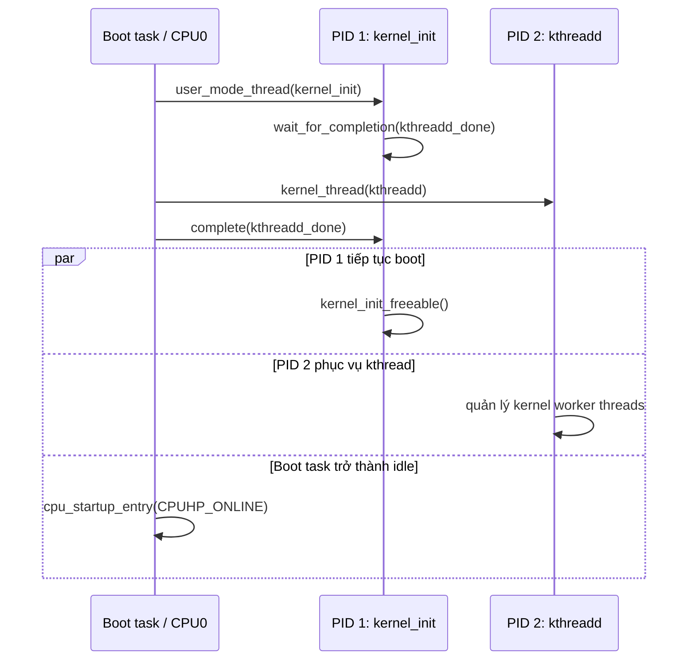
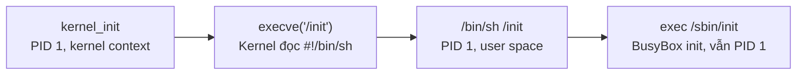

# Genesys2: luồng từ `start_kernel()` đến login prompt

Tài liệu này bám theo Linux 6.19.6, kernel `.config` và nội dung
`rootfs.cpio.gz` hiện có trong workspace.

> Kernel không trực tiếp thực hiện đăng nhập. Kernel khởi tạo hệ thống rồi
> `execve("/init")`. Dấu nhắc login được tạo ở user space bởi BusyBox
> `getty` và `login`.

## 1. Sơ đồ tổng thể

```mermaid
flowchart TD
    START["start_kernel() entry<br/>S-mode; MMU Sv39 on<br/>early_pg_dir active<br/>interrupt đang bị mask"]

    subgraph EARLY["A. start_kernel — early core/architecture init"]
        K1["set_task_stack_end_magic()<br/>smp_setup_processor_id()<br/>cgroup_init_early()"]
        K2["local_irq_disable()<br/>boot_cpu_init()<br/>page_address_init()<br/>Ghi Linux banner vào printk log"]
        K3["setup_arch(&command_line)"]
        K4["parse_dtb()<br/>Đọc memory, CPU, /chosen<br/>Lấy initrd start/end và command line"]
        K5["sbi_init()<br/>paging_init()<br/>Final kernel/linear mappings<br/>unflatten_device_tree()"]
        K6["Resources, ISA/hwcap, alternatives<br/>CONFIG_SMP=n: chỉ boot CPU"]
        K7["setup_command_line()<br/>parse_early_param() + parse_args()<br/>setup_per_cpu_areas()"]
    end

    subgraph CORE["B. Bộ nhớ, scheduler, IRQ, timer và console"]
        C1["setup_log_buf()<br/>vfs_caches_init_early()<br/>trap_init()<br/>mm_core_init()"]
        C2["sched_init()<br/>workqueue_init_early()<br/>rcu_init()"]
        C3["early_irq_init() → init_IRQ()<br/>PLIC/IRQ domain"]
        C4["tick/timers/hrtimers/softirq<br/>timekeeping_init() → time_init()"]
        C5["local_irq_enable()<br/>Interrupt bắt đầu hoạt động"]
        C6["console_init()<br/>Console ttySIF0 chính thức hoạt động"]
        C7["slab late, process/cred/security<br/>VFS/procfs/network namespace/cgroup"]
    end

    subgraph THREADS["C. rest_init — tạo các task nền đầu tiên"]
        R1["rest_init()<br/>rcu_scheduler_starting()"]
        R2["user_mode_thread(kernel_init)<br/>Tạo PID 1"]
        R3["PID 1 chờ kthreadd_done"]
        R4["kernel_thread(kthreadd)<br/>Tạo PID 2"]
        R5["complete(kthreadd_done)"]
        R6["Boot task → cpu_startup_entry()<br/>CPU idle loop"]
    end

    subgraph PID1["D. PID 1 — initcalls và initramfs"]
        I1["kernel_init_freeable()<br/>workqueue_init()<br/>init_mm_internals()"]
        I2["do_pre_smp_initcalls()<br/>smp_init() là no-op với SMP=n"]
        I3["do_basic_setup()<br/>driver_init() → do_initcalls()"]
        I4["pure → core → postcore → arch<br/>subsys → fs → rootfs → device → late"]
        I5["Probe built-in drivers<br/>SBI/PLIC, SiFive UART, GPIO<br/>Xilinx SPI, mmc-spi, Ethernet..."]
        I6["rootfs_initcall(populate_rootfs)<br/>Async giải nén external rootfs.cpio.gz"]
        I7["wait_for_initramfs()<br/>console_on_rootfs()"]
        I8["free_initmem()<br/>mark_readonly()<br/>system_state=SYSTEM_RUNNING"]
        I9["run_init_process('/init')<br/>Kernel execve sang user space"]
    end

    subgraph USER["E. User space — /init và BusyBox init"]
        U1["/init<br/>mount devtmpfs tại /dev"]
        U2["stdin/stdout/stderr<br/>→ /dev/console"]
        U3["exec /sbin/init<br/>BusyBox init tiếp tục giữ PID 1"]
        U4["Đọc /etc/inittab<br/>Chạy các entry sysinit tuần tự"]
        U5["Mount proc; remount / rw<br/>mount -a: devpts, tmpfs, sysfs<br/>hostname -F /etc/hostname"]
        U6["/etc/init.d/rcS<br/>Chạy S??* theo thứ tự"]
        U7["seedrng, syslogd, klogd, sysctl<br/>modules, network, crond, sshd"]
    end

    subgraph LOGIN["F. Serial getty và login"]
        G1["inittab action respawn<br/>/sbin/getty -L ttySIF0 115200 vt100"]
        G2["getty mở /dev/ttySIF0<br/>Cấu hình termios 115200 8N1<br/>Đọc /etc/issue"]
        G3["Welcome to Buildroot"]
        G4["buildroot login:"]
        G5["Nhập root<br/>/bin/login xác thực /etc/shadow"]
        G6["Root không có password<br/>exec /bin/sh → prompt #"]
    end

    START --> K1 --> K2 --> K3 --> K4 --> K5 --> K6 --> K7
    K7 --> C1 --> C2 --> C3 --> C4 --> C5 --> C6 --> C7
    C7 --> R1 --> R2 --> R3
    R2 --> R4 --> R5
    R5 --> R3
    R5 --> R6
    R3 --> I1 --> I2 --> I3 --> I4 --> I5 --> I6 --> I7 --> I8 --> I9
    I9 --> U1 --> U2 --> U3 --> U4 --> U5 --> U6 --> U7
    U7 --> G1 --> G2 --> G3 --> G4
    G4 -. "Sau khi người dùng nhập root" .-> G5 --> G6

    classDef kernel fill:#e2f0d9,stroke:#548235,color:#111;
    classDef core fill:#d9eaf7,stroke:#2f75b5,color:#111;
    classDef task fill:#e4dfec,stroke:#7030a0,color:#111;
    classDef init fill:#fff2cc,stroke:#bf9000,color:#111;
    classDef user fill:#fce4d6,stroke:#c55a11,color:#111;
    classDef login fill:#f4cccc,stroke:#a64d79,color:#111;
    classDef terminal fill:#c6e0b4,stroke:#385723,stroke-width:3px,color:#111;

    class START,K1,K2,K3,K4,K5,K6,K7 kernel;
    class C1,C2,C3,C4,C5,C6,C7 core;
    class R1,R2,R3,R4,R5,R6 task;
    class I1,I2,I3,I4,I5,I6,I7,I8,I9 init;
    class U1,U2,U3,U4,U5,U6,U7 user;
    class G1,G2,G3,G5,G6 login;
    class G4 terminal;
```



## 2. Pha đầu của `start_kernel()`

Khi `start_kernel()` bắt đầu, `head.S` đã bật MMU Sv39, cài trap vector và
chuyển `pc`, `gp`, `sp`, `tp` sang kernel virtual address. Tuy nhiên phần lớn
kernel subsystem vẫn chưa được khởi tạo.

Các nhóm lời gọi đầu tiên:

| Nhóm | Hàm tiêu biểu | Vai trò |
|---|---|---|
| Boot CPU | `smp_setup_processor_id()`, `boot_cpu_init()` | Đánh dấu CPU hiện tại là boot CPU |
| IRQ state | `local_irq_disable()` | Giữ interrupt tắt trong lúc dựng subsystem nền |
| Kiến trúc | `setup_arch()` | Parse DTB, SBI, page table cuối và hardware capability |
| Command line | `setup_command_line()`, `parse_early_param()`, `parse_args()` | Xử lý `earlycon`, `console` và tham số kernel |
| Per-CPU | `setup_per_cpu_areas()` | Tạo vùng dữ liệu riêng cho từng CPU |

### `setup_arch()` trên Genesys2

`setup_arch()` thực hiện các bước RISC-V quan trọng:

1. `parse_dtb()` scan DTB phẳng, đọc RAM, CPU, `/chosen/bootargs` và
   `linux,initrd-start/end`.
2. Command line hiệu lực là `earlycon console=ttySIF0,115200` nếu U-Boot
   không cung cấp `bootargs`, do `CONFIG_CMDLINE_FALLBACK=y`.
3. `sbi_init()` phát hiện các SBI extension do OpenSBI cung cấp.
4. `paging_init()` hoàn thiện `swapper_pg_dir`, kernel mapping và linear RAM
   mapping; đây là bước thay thế early mapping từ `head.S`.
5. `unflatten_device_tree()` biến flattened DTB thành cây `struct device_node`.
6. Kernel khởi tạo resource, ISA extensions, hardware capabilities và
   alternative instructions.

DTB có hai CPU nhưng `CONFIG_SMP=n`, nên chỉ boot CPU tham gia Linux.

## 3. Memory, scheduler, IRQ và timer

Sau `setup_arch()`, kernel dựng các subsystem mà process và driver cần:

- `mm_core_init()` hoàn thiện allocator nền, page allocator và slab sớm;
- `sched_init()` tạo scheduler data structures;
- `workqueue_init_early()` cho phép đăng ký work trước khi worker thread chạy;
- `rcu_init()` khởi tạo RCU;
- `init_IRQ()` khởi tạo interrupt controller và IRQ domain;
- `tick_init()`, `timers_init()`, `hrtimers_init()`, `timekeeping_init()` và
  `time_init()` đưa timer/timekeeping vào hoạt động.

Chỉ sau các bước trên kernel mới gọi:

```c
early_boot_irqs_disabled = false;
local_irq_enable();
console_init();
```

Từ đây timer/interrupt có thể chạy và console `ttySIF0` chính thức được đăng
ký. `earlycon` chỉ có nhiệm vụ in log trước mốc console chính thức này.

Kernel tiếp tục dựng process ID allocator, credential, security, VFS, procfs,
network namespace, cgroup và các cache còn lại, rồi gọi `rest_init()`.

## 4. `rest_init()`: PID 1, PID 2 và idle task

`rest_init()` tách boot flow thành ba execution context:



PID 1 được tạo trước để chắc chắn nhận PID số 1, nhưng phải chờ PID 2 sẵn
sàng vì initcalls có thể cần tạo kernel thread.

## 5. Initcalls và probe driver

Trong PID 1, `kernel_init_freeable()` gọi:

```text
workqueue_init()
  → do_pre_smp_initcalls()
  → smp_init()                 # gần như no-op vì CONFIG_SMP=n
  → do_basic_setup()
      → driver_init()
      → do_initcalls()
```

`do_initcalls()` chạy các callback theo mức liên kết trong kernel:

```text
pure → core → postcore → arch → subsys → fs → rootfs → device → late
```

Đây là giai đoạn phần lớn driver built-in được đăng ký/probe, gồm interrupt,
SiFive UART, GPIO, Xilinx SPI, `mmc-spi` và LowRISC Ethernet. Thứ tự chính xác
giữa các driver cùng một initcall level phụ thuộc thứ tự link object.

## 6. Giải nén initramfs và chuyển sang user space

FIT chứa external `rootfs.cpio.gz`; kernel không có built-in initramfs
(`CONFIG_INITRAMFS_SOURCE=""`). U-Boot ghi vị trí ramdisk vào DTB, sau đó
kernel reserve vùng này lúc parse DTB.

`rootfs_initcall(populate_rootfs)` schedule `do_populate_rootfs()` bất đồng bộ:

1. Giải nén `rootfs.cpio.gz` vào rootfs trong RAM.
2. Giải phóng vùng nhớ chứa initrd nén nếu không yêu cầu giữ lại.
3. `wait_for_initramfs()` trong PID 1 chờ giải nén hoàn tất.
4. `console_on_rootfs()` mở `/dev/console` làm file descriptor 0, 1 và 2.
5. Kernel giải phóng `.init` memory, đặt mapping read-only và chuyển
   `system_state` sang `SYSTEM_RUNNING`.

Biến mặc định trong `init/main.c` là:

```c
static char *ramdisk_execute_command = "/init";
```

Vì `/init` tồn tại và executable, kernel gọi `run_init_process("/init")`.
Đây là `execve`: PID 1 không đổi, nhưng image thực thi của task chuyển từ
kernel init thread thành chương trình user-space `/init`.

## 7. `/init` và BusyBox PID 1

`/init` trong initramfs thực hiện:

```sh
mount -t devtmpfs devtmpfs /dev

exec 0</dev/console
exec 1>/dev/console
exec 2>/dev/console

exec /sbin/init "$@"
```

Luồng thay thế image thực thi của PID 1 là:



`/init` đảm nhiệm ba việc:

1. **Tạo cây device node:** dù `CONFIG_DEVTMPFS_MOUNT=y`, kernel không tự
   mount devtmpfs khi root filesystem là initramfs. Script mount devtmpfs tại
   `/dev` để có `/dev/console`, `/dev/ttySIF0`, `/dev/null` và các device
   node do driver đăng ký.
2. **Nối standard I/O vào console:** file descriptor `0`, `1`, `2` lần
   lượt được mở lại thành stdin, stdout, stderr trên `/dev/console`. Log của
   BusyBox init, `rcS` và các service nhờ đó đi ra UART console.
3. **Bàn giao PID 1:** `/sbin/init` là symlink tới BusyBox. Từ khóa shell
   `exec` thay image `/bin/sh` bằng BusyBox init mà không fork và không đổi
   PID.

| File descriptor | Vai trò | Đích sau `/init` |
|---:|---|---|
| `0` | stdin | `/dev/console` |
| `1` | stdout | `/dev/console` |
| `2` | stderr | `/dev/console` |

Vì dòng đầu là `#!/bin/sh`, `run_init_process("/init")` không chạy trực tiếp
các lệnh shell. Kernel nhận diện shebang, nạp `/bin/sh`, rồi shell đọc script
`/init`. Lệnh `exec /sbin/init` cuối script mới chuyển PID 1 sang BusyBox
init.

Sau đó BusyBox init:

Đọc /etc/inittab

 → mount proc/sysfs/tmpfs
 → đặt hostname = buildroot
 → chạy /etc/init.d/rcS
 → khởi động syslogd, network, crond, sshd...
 → chạy getty trên ttySIF0
 → hiện "buildroot login:"

## 8. `/etc/inittab`, `rcS` và các service

BusyBox init xử lý các entry `sysinit` trong `/etc/inittab` trước:

1. Mount `/proc`.
2. Remount `/` read-write.
3. Tạo `/dev/pts`, `/dev/shm` và `/run/lock/subsys`.
4. `mount -a` theo `/etc/fstab`: devpts, tmpfs và sysfs.
5. Tạo symlink `/dev/fd`, `/dev/stdin`, `/dev/stdout`, `/dev/stderr`.
6. Chạy `hostname -F /etc/hostname`.
7. Chạy `/etc/init.d/rcS`.

`rcS` duyệt `/etc/init.d/S??*` theo thứ tự tên file:

| Thứ tự | Script | Tác dụng |
|---:|---|---|
| 1 | `S01seedrng` | Khởi tạo/lưu random seed |
| 2 | `S01syslogd` | Khởi động system logger |
| 3 | `S02klogd` | Thu kernel log |
| 4 | `S02sysctl` | Áp dụng sysctl |
| 5 | `S11modules` | Nạp module trong `modules-load.d` nếu có |
| 6 | `S40network` | Chạy `ifup -a`; cấu hình hiện chỉ auto loopback |
| 7 | `S50crond` | Khởi động cron daemon |
| 8 | `S50sshd` | Tạo host key nếu thiếu và khởi động OpenSSH |

BusyBox init chỉ khởi động getty sau khi toàn bộ các entry `sysinit`, bao gồm
`rcS`, đã hoàn thành.

## 9. Getty tạo login prompt

Entry cuối liên quan tới console trong `/etc/inittab` là:

```text
ttySIF0::respawn:/sbin/getty -L ttySIF0 115200 vt100
```

- `respawn`: nếu getty/login/shell kết thúc, BusyBox init tạo lại nó;
- `-L`: coi serial line là local, không chờ modem carrier detect;
- `ttySIF0`: trùng với `console=ttySIF0,115200` của kernel;
- `115200`: baud rate;
- `vt100`: giá trị biến `TERM` cho session.

Getty mở `/dev/ttySIF0`, cấu hình terminal, in nội dung `/etc/issue` rồi hiển
thị hostname. Với rootfs hiện tại:

```text
Welcome to Buildroot
buildroot login:
```

Kernel ban đầu dùng `CONFIG_DEFAULT_HOSTNAME="ariane-fpga"`, nhưng trước khi
getty chạy, BusyBox init thực thi `hostname -F /etc/hostname` và file này chứa
`buildroot`. Vì vậy login prompt dự kiến là `buildroot login:`, không phải
`ariane-fpga login:`.

Sau khi nhập `root`, getty exec BusyBox `login`. `/etc/shadow` hiện có tài
khoản root với password rỗng, nên login không yêu cầu mật khẩu và exec
`/bin/sh`; `/etc/profile` đặt prompt root thành `# `.

## 10. Đối chiếu `log_fullflow.txt`

Log thực tế xác nhận U-Boot đã đặt và bàn giao đủ ba thành phần FIT:

```text
Uncompressing Kernel Image to 82800000
Loading Ramdisk to bddef000, end be75ba96 ... OK
Loading Device Tree to 00000000bdde9000, end 00000000bddee804 ... OK
Starting kernel ...
```

Các mốc kernel đã quan sát được:

```text
[    0.000000] Linux version 6.19.6 ...
[    0.000000] SBI specification v3.0 detected
[    0.000000] earlycon: sifive0 at MMIO 0x0000000010020000
[    0.000000] Kernel command line: earlycon console=ttySIF0,115200
[    0.095230] devtmpfs: initialized
[    0.459360] Unpacking initramfs...
[    1.859110] 10020000.serial: ttySIF0 at MMIO 0x10020000 ...
[    1.868470] printk: console [ttySIF0] enabled
[    7.756680] Freeing initrd memory: 9648K
[    7.802210] Freeing unused kernel image (initmem) memory: 2144K
[    7.802540] Run /init as init process
[   14.879320] random: crng init done
```

Do đó có thể kết luận kernel đã:

- parse DTB và phát hiện OpenSBI;
- khởi tạo memory, IRQ, clocksource và network core;
- giải nén initramfs thành công;
- probe SiFive UART và chuyển từ early console sang `ttySIF0`;
- giải phóng initrd/initmem;
- gọi thành công đường `run_init_process("/init")`.

Tuy nhiên log hiện kết thúc sau `Run /init as init process` và chưa có các
dòng `Starting syslogd`, `Starting network`, `Welcome to Buildroot` hoặc
`buildroot login:`. Vì vậy phần BusyBox/rcS/getty ở các mục 7–9 là đường chạy
được xác định từ nội dung initramfs, nhưng **chưa được xác nhận đã hoàn tất
trên lần boot này**.

Dòng cảnh báo PLIC sau không chặn kernel tiếp tục boot:

```text
[    0.524960] riscv-plic: interrupt-controller@c000000: Invalid cpuid for context 3
[    0.532680] riscv-plic: ... mapped 8 interrupts with 1 handlers for 4 contexts.
```

Sau cảnh báo này kernel vẫn probe UART, bật console, giải phóng initrd và chạy
`/init`.

## 11. Source và artifact đối chiếu

- [`KERNEL_INIT_FLOW_GENESYS2.md`](KERNEL_INIT_FLOW_GENESYS2.md)
- [`KERNEL_START_TO_START_KERNEL_GENESYS2.md`](KERNEL_START_TO_START_KERNEL_GENESYS2.md)
- [`configs/genesys2/linux64_defconfig`](configs/genesys2/linux64_defconfig)
- [`configs/genesys2/buildroot64_defconfig`](configs/genesys2/buildroot64_defconfig)
- `buildroot/output/build/linux-6.19.6/init/main.c`
- `buildroot/output/build/linux-6.19.6/init/initramfs.c`
- `install64_genesys2/rootfs.cpio.gz:/init`
- `install64_genesys2/rootfs.cpio.gz:/etc/inittab`
- `install64_genesys2/rootfs.cpio.gz:/etc/init.d/rcS`
