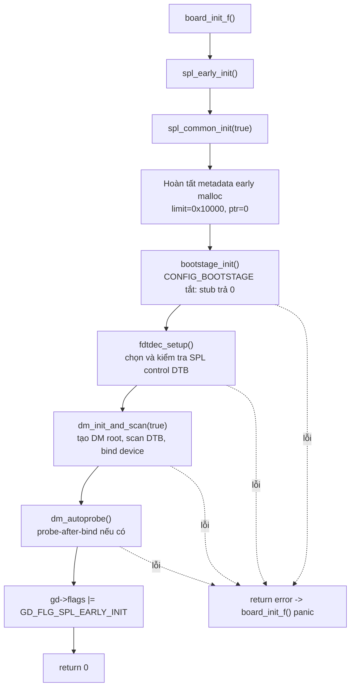
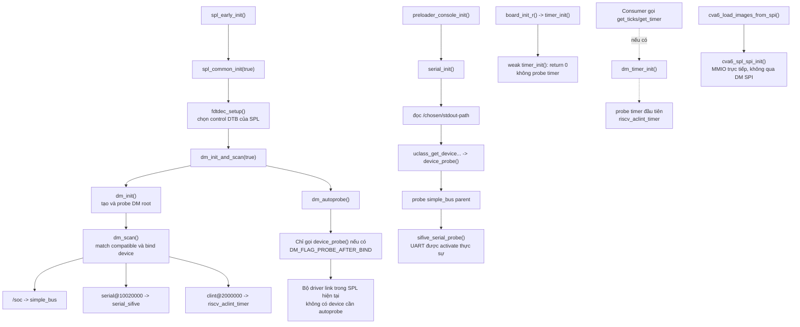
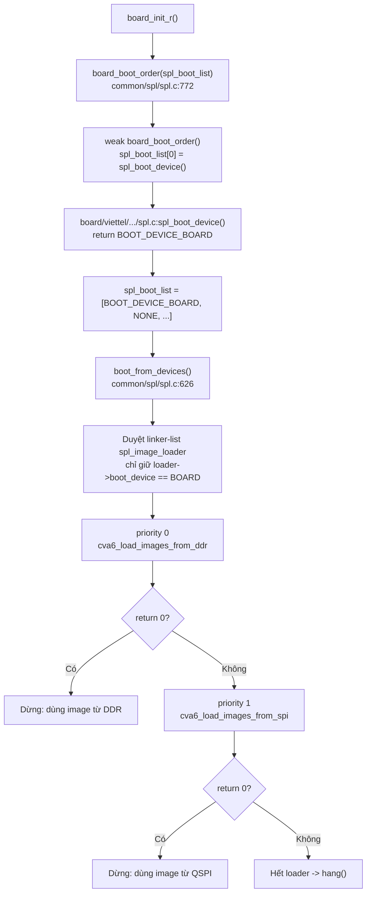
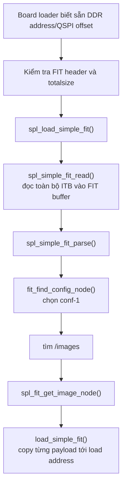
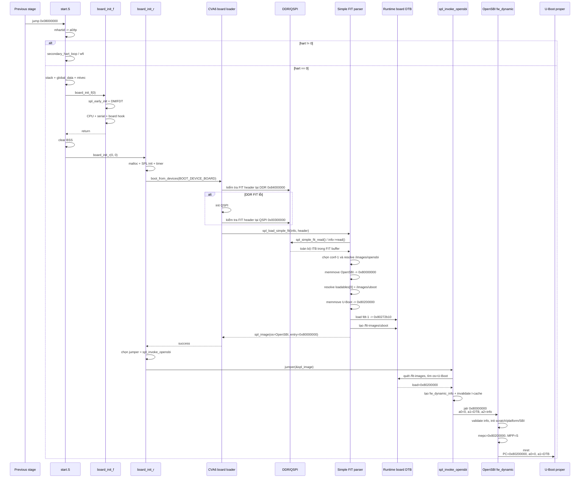

# Luồng U-Boot SPL từ `_start` đến handoff OpenSBI

## 1. Phạm vi và kết luận nhanh

Tài liệu này bám theo source và artifact hiện tại trong:

```text
buildroot/output/build/uboot-custom
```

Đối tượng được phân tích là U-Boot SPL 64-bit cho board
`viettel_cva6`, chạy ở RISC-V M-mode. Điểm cuối của tài liệu là lệnh gọi
OpenSBI tại `0x8000_0000`; phần OpenSBI tiếp tục chuyển sang U-Boot proper
chỉ được thể hiện để làm rõ dữ liệu handoff.

Luồng đang được build thực tế:

```text
_start @ 0x0800_0000
  -> chọn hart 0, tạo stack và global_data
  -> board_init_f()
  -> clear BSS
  -> board_init_r()
  -> thử FIT ở DDR 0x8400_0000
       nếu lỗi: thử u-boot.itb ở QSPI offset 0x0030_0000
  -> spl_load_simple_fit()
       OpenSBI     -> 0x8000_0000
       U-Boot      -> 0x8020_0000
       board DTB   -> 0x8027_2b10 trong artifact hiện tại
  -> spl_invoke_opensbi()
  -> PC=0x8000_0000, a0=0, a1=DTB, a2=&fw_dynamic_info
```

Các điểm dễ nhầm trong source hiện tại:

- Loader thực sự chạy theo thứ tự **DDR trước, QSPI sau**. Comment tại
  `board/viettel/viettel_cva6/spl.c:419` nói QSPI là priority 0, nhưng macro
  đăng ký và linker map xác nhận DDR priority 0, QSPI priority 1.
- Nhánh eMMC có trong source nhưng không tồn tại trong binary SPL vì
  `CONFIG_SPL_MMC` đang tắt.
- `spl_dram_init()` có đầy đủ code nhưng lệnh gọi đang bị comment. Dòng log
  `SPL: PL DDR initialization successful` hiện không chứng minh SPL đã init
  hoặc test DDR.
- `CONFIG_SPL_SMP` đang tắt. Chỉ hart 0 chạy SPL; các hart khác bị giữ trong
  `secondary_hart_loop` và SPL chỉ gọi OpenSBI trên hart 0.
- `CONFIG_SPL_NPU_HANDOFF_BUILD` đang tắt, nên các nhánh load/handoff NPU
  không xuất hiện trong binary SPL hiện tại.

## 2. Sơ đồ tổng thể

```mermaid
flowchart TD
    IN["Previous stage nhảy vào SPL<br/>PC = 0x0800_0000"]

    subgraph ASM["1. arch/riscv/cpu/start.S — M-mode"]
        S0["_start<br/>a0 = mhartid; tp = a0<br/>s1 = DTB đầu vào từ a1"]
        S1["gp = 0<br/>mtvec = trap_entry<br/>mie = 0"]
        H{"hart ID = 0?"}
        PARK["secondary_hart_loop<br/>wfi"]
        S2["sp = CONFIG_SPL_STACK<br/>0x0806_0000, align 16"]
        S3["board_init_f_alloc_reserve()<br/>harts_early_init()<br/>board_init_f_init_reserve()"]
        S4["Lưu gd->arch.boot_hart = 0<br/>gp trỏ tới global_data"]
    end

    subgraph INITF["2. arch/riscv/lib/spl.c — board_init_f"]
        F1["spl_early_init()<br/>khởi tạo malloc_f, FDT và Driver Model"]
        DM1["dm_init_and_scan(true)<br/>bind node SPL DTB với driver<br/>chưa đồng nghĩa đã probe"]
        DM2["dm_autoprobe()<br/>chỉ probe device có<br/>DM_FLAG_PROBE_AFTER_BIND"]
        F2["riscv_cpu_setup()<br/>đọc ISA, cấu hình CSR/FPU/MMU state"]
        F3["preloader_console_init() -> serial_init()<br/>chọn stdout-path, probe SiFive UART<br/>in banner U-Boot SPL"]
        F4["spl_board_init_f()<br/>in banner Viettel"]
        NOTE_DDR["Hiện tại: ret = 0<br/>spl_dram_init() bị comment"]
    end

    subgraph ASM2["3. Quay lại start.S"]
        A1["Clear SPL BSS<br/>0x0804_0000..."]
        A2["spl_relocate_stack_gd() = 0<br/>CONFIG_SPL_STACK_R tắt"]
        A3["board_init_r(0, 0)"]
    end

    subgraph INITR["4. common/spl/spl.c — board_init_r"]
        R1["spl_set_bd()<br/>init full malloc 8 MiB @ 0x8050_0000<br/>spl_init() + timer_init()"]
        R2["board_boot_order()<br/>tạo danh sách boot device"]
        R2B["spl_boot_device()<br/>trả BOOT_DEVICE_BOARD<br/>không đọc strap/MMIO"]
        R3["boot_from_devices()<br/>lọc linker-list theo BOOT_DEVICE_BOARD<br/>thử loader theo priority"]
    end

    subgraph LOAD["5. Board loaders theo linker order"]
        D0["Priority 0: DDR loader<br/>FIT source @ 0x8400_0000"]
        DOK{"FIT DDR hợp lệ<br/>và load thành công?"}
        Q1["Priority 1: QSPI loader<br/>init SPI + JEDEC self-test"]
        Q2["Đọc u-boot.itb<br/>QSPI offset 0x0030_0000"]
        FAIL["Không loader nào thành công<br/>hang()"]
    end

    subgraph FIT["6. spl_load_simple_fit"]
        C1["Chọn /configurations/conf-1"]
        C2["firmware = opensbi<br/>copy tới 0x8000_0000<br/>os = IH_OS_OPENSBI"]
        C3["loadables = uboot<br/>copy tới 0x8020_0000"]
        C4["fdt = fdt-1<br/>copy board DTB sau U-Boot<br/>hiện tại 0x8027_2b10"]
        C5["spl_image:<br/>os=OpenSBI<br/>entry=0x8000_0000<br/>fdt_addr=board DTB"]
    end

    subgraph HANDOFF["7. spl_invoke_opensbi"]
        O1["Tìm image os=U-Boot trong /fit-images<br/>next_addr = 0x8020_0000"]
        O2["Tạo fw_dynamic_info<br/>next_mode = S-mode<br/>boot_hart = 0"]
        O3["invalidate_icache_all()"]
        O4["Gọi OpenSBI entry<br/>PC=0x8000_0000<br/>a0=0<br/>a1=DTB<br/>a2=&fw_dynamic_info"]
    end

    NEXT["OpenSBI chạy ở M-mode<br/>sau đó nhảy U-Boot proper<br/>0x8020_0000 ở S-mode"]

    IN --> S0 --> S1 --> H
    H -- Không --> PARK
    H -- Có --> S2 --> S3 --> S4 --> F1 --> DM1 --> DM2 --> F2 --> F3 --> F4 --> NOTE_DDR
    NOTE_DDR --> A1 --> A2 --> A3 --> R1 --> R2 --> R2B --> R3 --> D0 --> DOK
    DOK -- Có --> C1
    DOK -- Không --> Q1 --> Q2
    Q2 -- Lỗi --> FAIL
    Q2 -- Thành công --> C1
    C1 --> C2 --> C3 --> C4 --> C5 --> O1 --> O2 --> O3 --> O4
    O4 -. "ngoài phạm vi chính" .-> NEXT

    classDef asm fill:#e4dfec,stroke:#7030a0,color:#111;
    classDef init fill:#d9eaf7,stroke:#2f75b5,color:#111;
    classDef load fill:#fff2cc,stroke:#bf9000,color:#111;
    classDef fit fill:#e2f0d9,stroke:#548235,color:#111;
    classDef handoff fill:#fce4d6,stroke:#c55a11,stroke-width:3px,color:#111;
    classDef warning fill:#f4cccc,stroke:#a61c00,color:#111;

    class S0,S1,H,PARK,S2,S3,S4,A1,A2,A3 asm;
    class F1,DM1,DM2,F2,F3,F4,R1,R2,R2B,R3 init;
    class D0,DOK,Q1,Q2 load;
    class C1,C2,C3,C4,C5 fit;
    class O1,O2,O3,O4,NEXT handoff;
    class NOTE_DDR,FAIL warning;
```



## 3. Pha 1: `_start` và chọn boot hart

Entry nằm tại `arch/riscv/cpu/start.S:41`. Linker map hiện tại xác nhận:

```text
_start = 0x08000000
```

### 3.1 Trạng thái đầu vào

SPL được build với:

```text
CONFIG_SPL_64BIT=y
CONFIG_SPL_RISCV_MMODE=y
CONFIG_SPL_RISCV_FIXED_BOOT_HART=y
CONFIG_SPL_RISCV_BOOT_HART_ID=0
```

Vì chạy M-mode, `_start` đọc `mhartid` vào `a0`, sau đó giữ hart ID trong
`tp`. Giá trị DTB được stage trước truyền trong `a1` được giữ tạm trong `s1`.

Tiếp theo SPL thiết lập môi trường tối thiểu:

1. Đặt `gp = 0` để tránh dùng global data chưa khởi tạo.
2. Ghi `mtvec = trap_entry`.
3. Ghi `mie = 0`, mask toàn bộ interrupt cục bộ.
4. So sánh `mhartid` với boot hart cố định là 0.

Hart 0 đi tiếp. Hart khác nhảy vào `secondary_hart_loop` và lặp `wfi`. Do
`CONFIG_SPL_NPU_HANDOFF_BUILD` và `CONFIG_SPL_SMP` đều tắt, binary hiện tại
không có đường đánh thức/handoff secondary hart trong pha này.

### 3.2 Stack và `global_data`

Hart 0 đặt `t0 = CONFIG_SPL_STACK = 0x0806_0000`, align xuống 16 byte rồi
gán `sp = t0`. Vì `CONFIG_SPL_SMP` tắt, chỉ một vùng stack được tính. Kích
thước mỗi stack là `1 << CONFIG_STACK_SIZE_SHIFT = 1 << 14 = 0x4000`, nên
`start.S` tính địa chỉ ngay dưới stack và truyền trong `a0`:

```text
a0 = 0x0806_0000 - 0x4000
   = 0x0805_c000
```

Giá trị này là `top` của vùng reserve cho early malloc và `global_data`, không
phải giá trị `sp` mới.

#### 3.2.1 `board_init_f_alloc_reserve(top)`

Implementation nằm tại `common/init/board_init.c:81`. Hàm này **chỉ tính địa
chỉ**, không ghi bộ nhớ và cũng không thay đổi `sp`:

1. Vì `CONFIG_SPL_SYS_MALLOC_F=y` và không có `CFG_MALLOC_F_ADDR` cố định,
   trừ `CONFIG_SPL_SYS_MALLOC_F_LEN = 0x10000` khỏi `top` để dành early malloc:

   ```text
   0x0805_c000 - 0x10000 = 0x0804_c000
   ```

2. Dành `sizeof(struct global_data)` ở phía địa chỉ thấp hơn. Trong binary SPL
   hiện tại `sizeof(gd_t) = 0x100`; kết quả được align xuống biên 16 byte:

   ```text
   rounddown(0x0804_c000 - 0x100, 16) = 0x0804_bf00
   ```

3. Trả `0x0804_bf00` trong `a0`. `start.S` lưu giá trị này vào `s0` để giữ
   địa chỉ `gd` qua lời gọi tiếp theo.

Tên hàm có chữ `alloc`, nhưng không có heap allocator ở đây; phép trừ địa chỉ
chính là cơ chế “reserve” vùng nằm dưới stack.

#### 3.2.2 `harts_early_init()`

`start.S` gọi hàm này sau khi lưu `gd` dự kiến vào `s0`, nhưng trước khi khởi
tạo nội dung `gd`. API này cho phép SoC override để cấu hình feature hoặc CSR
riêng trên từng hart; code dùng chung nằm tại `arch/riscv/cpu/cpu.c:722`.

Đối với binary `viettel_cva6` hiện tại:

- Không có implementation strong của board/SoC override hàm weak này.
- Symbol tại `0x0800_045c` chỉ chứa lệnh `ret`.
- Do fixed boot hart đã loại các hart khác từ trước, chỉ hart 0 đến được đây.
- Vì vậy hàm **không sửa CSR, không sửa stack và không sửa `global_data`**.

#### 3.2.3 `board_init_f_init_reserve(base)`

`start.S` chuyển `s0` trở lại `a0`, nên đầu vào `base = 0x0804_bf00`. Hàm tại
`common/init/board_init.c:137` thực hiện lần lượt:

1. Ép `base` thành `gd_ptr` và zero toàn bộ `sizeof(gd_t) = 0x100` byte:

   ```text
   memset(0x0804_bf00, 0, 0x100)
   ```

2. Gọi `arch_setup_gd(gd_ptr)`. Trên RISC-V, hàm này đặt thanh ghi `gp` trỏ
   tới `0x0804_bf00`; từ đây C code mới được phép truy cập `gd->...`.
3. Tăng `base` thêm `roundup(sizeof(gd_t), 16) = 0x100`, thu được
   `0x0804_c000`.
4. Ghi `gd->malloc_base = 0x0804_c000`. Hàm chưa đặt `malloc_limit` hay
   `malloc_ptr`; `spl_common_init(true)` sẽ đặt chúng thành `0x10000` và `0`.
5. `CONFIG_SPL_ZERO_MEM_BEFORE_USE` và stack-usage reporting đều tắt, nên
   early malloc arena không bị zero và không có stack canary trong bước này.

Sau khi hàm trả về, `start.S` còn ghi hai field kiến trúc:

```text
gd->arch.firmware_fdt_addr = s1   // DTB nhận từ stage trước
gd->arch.boot_hart         = tp   // hart 0
```

Layout cuối cùng trước khi gọi `board_init_f()`:

```text
Địa chỉ cao
0x0806_0000  <- sp, stack top
              [ stack hart 0: 0x4000 byte ]
0x0805_c000  <- top truyền cho board_init_f_alloc_reserve()
              [ early malloc: 0x10000 byte ]
0x0804_c000  <- gd->malloc_base
              [ global_data: 0x100 byte ]
0x0804_bf00  <- gp = s0 = địa chỉ gd
Địa chỉ thấp
```

Sau khi `gp` hợp lệ, assembly gọi `board_init_f(0)` tại
`arch/riscv/cpu/start.S:242`.

## 4. Pha 2: `board_init_f()`

RISC-V cung cấp implementation tại `arch/riscv/lib/spl.c:22`:

```text
board_init_f()
  -> spl_early_init()
  -> riscv_cpu_setup()
  -> preloader_console_init()
  -> spl_board_init_f()
```

### 4.1 `spl_early_init()`

`board_init_f()` gọi `spl_early_init()` tại `arch/riscv/lib/spl.c:26`, trước
`riscv_cpu_setup()` và trước khi console được khởi tạo. Wrapper tại
`common/spl/spl.c:542` có logic tương đương:

```c
ret = spl_common_init(true);
if (ret)
        return ret;

gd->flags |= GD_FLG_SPL_EARLY_INIT;
return 0;
```

Tham số `true` yêu cầu `spl_common_init()` thiết lập allocator sớm. Nếu bất kỳ
bước bắt buộc nào trả lỗi, `spl_early_init()` không đặt cờ hoàn tất và trả lỗi
cho `board_init_f()`; caller sau đó gọi `panic("spl_early_init() failed...")`.
Lúc này serial console chưa được probe, nên khả năng nhìn thấy thông báo phụ
thuộc đường output rất sớm/debug UART của platform.

Luồng đầy đủ trong build hiện tại:



#### 4.1.1 Hoàn tất early malloc

`board_init_f_init_reserve()` trước đó mới chỉ đặt:

```text
gd->malloc_base = 0x0804_c000
```

Vì `CONFIG_SPL_SYS_MALLOC_F=y`, `spl_common_init(true)` bổ sung:

```text
gd->malloc_limit = CONFIG_SPL_SYS_MALLOC_F_LEN = 0x10000
gd->malloc_ptr   = 0
```

Như vậy allocator sớm có arena `0x0804_c000..0x0805_bfff`, dung lượng 64 KiB,
và chưa cấp phát byte nào. Đây là `malloc_f` dùng trong pha init sớm, khác với
full malloc heap 8 MiB được mở bằng `mem_malloc_init()` trong `board_init_r()`.

#### 4.1.2 Bootstage và logging

Source vẫn gọi `bootstage_init()`, `bootstage_mark_name()` và đo thời gian DM,
nhưng `CONFIG_BOOTSTAGE` đang tắt nên các lời gọi bootstage compile thành stub;
không có buffer hay record bootstage thực tế. `CONFIG_LOG` cũng tắt, vì vậy
nhánh `log_init()` không được biên dịch vào SPL. `CONFIG_SPL_LOGLEVEL=4` chỉ đặt
mức log nếu logging được bật, không tự bật logging.

#### 4.1.3 `fdtdec_setup()`: chọn control DTB của SPL

`CONFIG_SPL_OF_REAL=y`, nên `spl_common_init()` gọi `fdtdec_setup()` tại
`lib/fdtdec.c:1690`. Artifact hiện tại dùng `CONFIG_OF_SEPARATE=y`:

1. Lấy DTB được append ngay sau phần binary SPL và gán vào `gd->fdt_blob`.
2. Gán `gd->fdt_src = FDTSRC_SEPARATE`.
3. Kiểm tra pointer, alignment và FDT header bằng `fdtdec_prepare_fdt()`.
4. Gọi weak board hook `fdtdec_board_setup()`; build này không override nên
   hook trả 0.
5. Reset oftree để các truy vấn `ofnode` sau đó dùng blob vừa chọn.

Linker/artifact hiện tại cho kết quả cụ thể:

```text
SPL image end / control DTB start = 0x0800_bc70
SPL control DTB size             = 0x076b = 1899 byte
File                              = spl/u-boot-spl.dtb
```

Control DTB này mô tả phần cứng cần cho chính SPL, trong đó có `/soc`, SiFive
UART và CLINT timer. Nó không phải `gd->arch.firmware_fdt_addr` nhận từ stage
trước, cũng không phải board DTB mà FIT loader sẽ nạp và truyền sang OpenSBI.

#### 4.1.4 Dựng Driver Model

Vì `CONFIG_SPL_DM=y` và `CONFIG_SPL_OF_PLATDATA` tắt, lời gọi tại
`common/spl/spl.c:517` trở thành:

```c
dm_init_and_scan(true);
```

Giá trị `true` là `pre_reloc_only`: chỉ bind các node/driver đủ điều kiện dùng
trước relocation. Bên trong hàm:

1. `dm_init()` khởi tạo uclass infrastructure, bind `root_driver`, gắn root
   `ofnode` và probe DM root. `gd->dm_root` từ đây hợp lệ.
2. `dm_scan(true)` scan linker tables và SPL control DTB, match `compatible`
   với `U_BOOT_DRIVER`, rồi **bind** các device phù hợp.
3. `dm_scan_other()` là weak hook và trả 0 trong build này.
4. `CONFIG_SPL_DM_EVENT` không bật, nên không phát `EVT_DM_POST_INIT_F` trong
   binary SPL dù U-Boot proper có `CONFIG_DM_EVENT=y`.

Sau scan, `spl_common_init()` gọi `dm_autoprobe()`. Hàm này duyệt cây vừa bind
nhưng chỉ gọi `device_probe()` cho device có `DM_FLAG_PROBE_AFTER_BIND`. Không
có driver liên quan trong build hiện tại mang flag đó; vì vậy bước này không
probe UART hay timer. Vị trí probe thực tế được trình bày tại mục 4.2.

#### 4.1.5 Đánh dấu hoàn tất

Chỉ sau khi tất cả bước trên thành công, wrapper mới OR
`GD_FLG_SPL_EARLY_INIT = 0x08000` vào `gd->flags`. Cờ này được dùng lại trong
`board_init_r()`:

```text
spl_init()
  -> thấy GD_FLG_SPL_EARLY_INIT đã bật
  -> không gọi lại spl_common_init()
  -> chỉ đặt thêm GD_FLG_SPL_INIT
```

Vì vậy control DTB và cây Driver Model chỉ được dựng một lần trong flow hiện
tại; `spl_init()` ở pha sau không scan/probe lại toàn bộ driver.

### 4.2 Driver được bind và probe ở đâu?

Hai khái niệm cần tách riêng:

- **Bind**: tạo `struct udevice` và nối node DTB với `U_BOOT_DRIVER`; chưa chắc
  đã truy cập phần cứng.
- **Probe**: `device_probe()` chạy `of_to_plat`, probe parent, rồi gọi callback
  `.probe` của driver; từ đây driver mới được activate.

Trong build này `CONFIG_SPL_OF_PLATDATA` tắt, nên `spl_common_init()` gọi
`dm_init_and_scan(true)` tại `common/spl/spl.c:517`. Luồng DM là:



Trạng thái các driver liên quan trong flow hiện tại:

| Driver/khối | Bind ở đâu | Probe/khởi tạo phần cứng ở đâu | Ghi chú |
|---|---|---|---|
| `root_driver` | `dm_init()` | Ngay trong `dm_init()` | Root của toàn bộ cây DM |
| `simple_bus` cho `/soc` | `dm_scan()` | Được probe trước child khi `device_probe(serial)` | Là parent của UART và CLINT |
| `serial_sifive` | `dm_scan()` match `sifive,uart0` | `preloader_console_init()` -> `serial_init()` -> `device_probe()` | Đây là probe chắc chắn xảy ra trước banner SPL |
| `riscv_aclint_timer` | `dm_scan()` match `riscv,clint0` | Lazy qua `dm_timer_init()` nếu code gọi timer API | `timer_init()` trong `board_init_r()` hiện là weak no-op |
| CVA6 QSPI | Không bind DM driver | `cva6_spl_spi_init()` trong QSPI loader | Truy cập MMIO trực tiếp; `CONFIG_SPL_DM_SPI` đang tắt |
| eMMC/MMC | Không có loader trong SPL | Không probe trong flow này | `CONFIG_SPL_MMC` đang tắt |

`dm_autoprobe()` tại `drivers/core/root.c:325` duyệt cây đã bind, nhưng chỉ
probe device có `DM_FLAG_PROBE_AFTER_BIND`. Các driver đang link cho flow này
không mang flag đó, vì vậy UART không được probe tại `dm_autoprobe()` mà tại
`serial_init()` sau đó.

### 4.3 CPU, console và hook của board

`riscv_cpu_setup()` tìm CPU device, đọc ISA và cấu hình FPU/các CSR liên quan.
Trong SPL DTB hiện tại, `cpu@1` bị `status = "disabled"` và boot-hart
`cpu@0` không còn trong DTB đã rút gọn, nên lời gọi trực tiếp này có thể trả
`-ENODEV`; `board_init_f()` không kiểm tra return của nó. Sau đó
`preloader_console_init()` gọi `serial_init()`, probe UART và in banner:

```text
U-Boot SPL 2026.01 (...)
```

Hook strong `spl_board_init_f()` của CVA6 nằm tại
`board/viettel/viettel_cva6/spl.c:636`. Code hiện tại tương đương:

```c
int ret = 0; // spl_dram_init();
```

Vì vậy nó chỉ in banner Viettel và dòng thành công, không gọi logic chờ MIG,
test pattern DDR hay cập nhật `gd->ram_base/gd->ram_size` trong
`spl_dram_init()`.

## 5. Pha 3: clear BSS và vào `board_init_r()`

Khi `board_init_f()` return, control quay lại
`arch/riscv/cpu/start.S:246`:

1. Zero vùng `__bss_start` đến `__bss_end`.
2. Gọi `spl_relocate_stack_gd()`.
3. Vì `CONFIG_SPL_STACK_R` tắt, hàm trả 0; SPL tiếp tục dùng stack ban đầu.
4. Nhảy thẳng vào `board_init_r(0, 0)`.

Các địa chỉ từ linker map hiện tại:

```text
SPL image start = 0x08000000
SPL image end   = 0x0800bc70
SPL BSS start  = 0x08040000
SPL BSS end    = 0x080400a8
SPL stack top  = 0x08060000
```

## 6. Pha 4: `board_init_r()` và chọn loader

Flow chính tại `common/spl/spl.c:689`:

```text
board_init_r()
  -> spl_set_bd()
  -> mem_malloc_init(0x80500000, 0x00800000)
  -> spl_init()
  -> timer_init()
  -> memset(spl_image, 0)
  -> board_boot_order(spl_boot_list)
  -> boot_from_devices()
```

`board_boot_order()` dùng weak default và gọi `spl_boot_device()`. Hook board
tại `board/viettel/viettel_cva6/spl.c:440` luôn trả
`BOOT_DEVICE_BOARD`, nên framework chỉ xét các loader đăng ký cho loại này.

### 6.1 Boot device được chọn ở đâu?

Việc chọn nguồn boot diễn ra theo hai tầng, đều trong `board_init_r()`:



Cụ thể:

1. `board_init_r()` gọi `board_boot_order()` tại `common/spl/spl.c:772`.
2. Board không override `board_boot_order()`, nên weak implementation tại
   `common/spl/spl.c:578` gọi `spl_boot_device()`.
3. Hook `spl_boot_device()` tại `board/viettel/viettel_cva6/spl.c:440` trả
   cố định `BOOT_DEVICE_BOARD`.
4. `boot_from_devices()` tại `common/spl/spl.c:626` duyệt linker-list
   `spl_image_loader`, lọc các record có cùng `boot_device`, rồi gọi từng
   `load_image()` theo thứ tự priority đã được encode trong tên linker entry.

Vì vậy build hiện tại **không đọc boot strap, GPIO, register boot-mode hay
biến môi trường để chọn DDR/QSPI**. `BOOT_DEVICE_BOARD` chỉ là một nhóm loader
logic; việc chọn nguồn vật lý xảy ra bằng cơ chế thử lần lượt: DDR thành công
thì dừng, DDR lỗi mới chuyển sang QSPI.

### 6.2 Thứ tự loader thực tế

Linker list trong `spl/u-boot-spl.map` có thứ tự:

```text
BOOT_DEVICE_BOARD0cva6_load_images_from_ddr
BOOT_DEVICE_BOARD1cva6_load_images_from_spi
```

Do đó `boot_from_devices()` chạy:

| Thứ tự | Loader | Nguồn | Khi nào dừng |
|---:|---|---|---|
| 1 | `cva6_load_images_from_ddr()` | FIT tại `0x8400_0000` | Return 0 thì dùng ngay, không thử QSPI |
| 2 | `cva6_load_images_from_spi()` | FIT tại QSPI offset `0x0030_0000` | Chỉ chạy khi DDR loader trả lỗi |

Nhánh `cva6_load_images_from_emmc()` được bao bởi
`CONFIG_IS_ENABLED(MMC)`. Trong SPL, macro này kiểm tra `CONFIG_SPL_MMC`, đang
tắt; linker map vì vậy không có eMMC loader.

Nếu cả DDR và QSPI đều lỗi, `boot_from_devices()` trả lỗi và
`board_init_r()` gọi `hang()`.

## 7. Pha 5: load FIT từ DDR hoặc QSPI

### 7.1 Đường DDR

`cva6_load_images_from_ddr()` tại
`board/viettel/viettel_cva6/spl.c:160` dùng:

```text
FIT address  = CONFIG_SPL_LOAD_FIT_ADDRESS = 0x84000000
maximum size = CONFIG_CVA6_SPL_UBOOT_FIT_MAX_SIZE = 0x00200000
```

Trước khi gọi FIT parser, code kiểm tra:

- `fit_check_format()` phải thành công.
- `fdt_totalsize()` phải khác 0 và không vượt quá 2 MiB.

Callback `cva6_mem_fit_read()` đọc container bằng `memcpy()` từ vùng DDR đã
có sẵn FIT. Loader này không tự lấy FIT từ storage vào `0x8400_0000`; một
stage hoặc debugger trước đó phải preload nó.

### 7.2 Đường QSPI fallback

Nếu FIT ở DDR không hợp lệ, framework gọi
`cva6_load_images_from_spi()` tại
`board/viettel/viettel_cva6/spl.c:352`:

```text
cva6_spl_spi_init()
  -> cấu hình SPI controller MMIO
  -> đọc JEDEC ID để self-test

cva6_spl_spiflash_load_fit()
  -> đọc FIT header ở QSPI offset 0x00300000
  -> kiểm tra FDT magic và totalsize <= 2 MiB
  -> spl_load_simple_fit()
```

QSPI reader dùng lệnh SPI NOR `0x03` với địa chỉ 3 byte. Mỗi lần đọc bị giới
hạn trong cửa sổ flash 8 MiB. Source liên quan nằm tại:

- `board/viettel/viettel_cva6/spl_spi.c:102`
- `board/viettel/viettel_cva6/spl_spiflash.c:43`
- `board/viettel/viettel_cva6/spl_spiflash.c:124`

## 8. Pha 6: parse ITB và nạp từng payload

Artifact đang dùng là
`buildroot/output/build/uboot-custom/u-boot.itb`. FIT/ITB thực chất là một FDT
container: `/configurations` chỉ ra tập image cần dùng, còn `/images` chứa
metadata và data của từng payload.

```text
/configurations
  default = "conf-1"
  /conf-1
    firmware = "opensbi"
    loadables = "uboot"
    fdt       = "fdt-1"
```

| FIT image | `type` | `os` | `load` | `entry` | Kích thước hiện tại |
|---|---|---|---:|---:|---:|
| `opensbi` | `firmware` | `opensbi` | `0x8000_0000` | `0x8000_0000` | 272,992 byte |
| `uboot` | `standalone` | `U-Boot` | `0x8020_0000` | không khai báo | 469,776 byte |
| `fdt-1` | `flat_dt` | không có | không khai báo | không có | 10,245 byte |

Chi tiết cấu trúc FIT được phân tích riêng trong
[`UBOOT_ITB_ANALYSIS.md`](UBOOT_ITB_ANALYSIS.md).

### 8.1 Hàm nào “quét” ITB?

Không có hàm nào tìm kiếm ITB trên toàn bộ DDR hoặc QSPI. Board loader đã biết
chính xác vị trí container:

```text
DDR : địa chỉ 0x8400_0000
QSPI: offset  0x0030_0000
```

`cva6_validate_ddr_fit()` hoặc `cva6_spl_spiflash_load_fit()` chỉ đọc header
tại vị trí đó, kiểm tra FDT magic/format và `totalsize`. Việc đọc và parse cây
ITB sau đó được chia cho các hàm sau:

| Hàm | Phần việc |
|---|---|
| `spl_load_simple_fit()` | Điều phối toàn bộ quá trình đọc, parse và load FIT |
| `spl_simple_fit_read()` | Đọc toàn bộ FIT container vào một buffer độc lập |
| `spl_simple_fit_parse()` | Chọn configuration và tìm node `/images` |
| `fit_find_config_node()` | Duyệt các node con của `/configurations`, ưu tiên board match rồi `default` |
| `spl_fit_get_image_name()` | Đọc chuỗi `firmware`, `loadables[index]` hoặc `fdt` từ configuration đã chọn |
| `spl_fit_get_image_node()` | Dùng tên vừa đọc để tìm node tương ứng dưới `/images` |
| `load_simple_fit()` | Đọc metadata, copy data của đúng một image tới địa chỉ `load` |

Nói ngắn gọn, hàm “quét cấu trúc ITB” là `spl_simple_fit_parse()` kết hợp với
`fit_find_config_node()` và `spl_fit_get_image_node()`; còn hàm trực tiếp nạp
từng payload là `load_simple_fit()`.



### 8.2 Đọc FIT container vào RAM

`spl_simple_fit_read()` tại `common/spl/spl_fit.c:703` lấy `fdt_totalsize()` từ
header. ITB hiện tại có tổng kích thước `0x000b855d = 755,037` byte và chứa data
embedded, nên hàm:

1. Xin buffer qua `board_spl_fit_buffer_addr()`; weak default cuối cùng dùng
   full malloc heap của SPL.
2. Gọi callback `info->read()` để đọc toàn bộ container vào buffer.
3. Gán `ctx.fit` trỏ tới bản FIT trong buffer này.

Callback phụ thuộc nguồn boot:

```text
DDR  -> cva6_mem_fit_read()          -> memcpy từ 0x8400_0000
QSPI -> cva6_spl_spiflash_fit_read() -> SPI NOR read từ offset 0x0030_0000
```

Từ bước này trở đi FIT parser không cần biết container đến từ DDR hay QSPI;
mọi truy vấn đều làm trên `ctx.fit`.

### 8.3 Chọn `/configurations/conf-1`

`spl_simple_fit_parse()` tại `common/spl/spl_fit.c:775` gọi
`fit_find_config_node()`:

1. Tìm `/configurations` bằng `fdt_path_offset()`.
2. Đọc property `default = "conf-1"`.
3. Duyệt từng configuration và gọi `board_fit_config_name_match()`.
4. Board CVA6 không override hook này; weak implementation không match node
   nào, nên hàm trả node được đánh dấu `default`, tức `conf-1`.
5. Tìm và lưu offset của `/images` vào `ctx.images_node`.

`CONFIG_SPL_FIT_SIGNATURE` đang tắt, do đó flow hiện tại chỉ kiểm tra cấu trúc
FDT/FIT; nó không xác thực chữ ký mật mã của configuration hay payload.

### 8.4 Nạp firmware chính: OpenSBI

`spl_load_simple_fit()` chọn image chính theo thứ tự:

```text
configuration.firmware[0]
  -> nếu không có và SPL OS boot bật: configuration.kernel[0]
  -> nếu vẫn không có: configuration.loadables[0]
```

Trong `conf-1`, `firmware = "opensbi"`. `spl_fit_get_image_node()` resolve tên
này thành `/images/opensbi`, rồi `load_simple_fit()`:

1. Đọc `load = 0x8000_0000`.
2. Vì data nằm embedded trong ITB, lấy pointer/size bằng
   `fit_image_get_emb_data()`.
3. Image không nén, nên `memmove()` 272,992 byte tới `0x8000_0000`.
4. Đọc `entry = 0x8000_0000`.
5. Sau khi return, parser đọc `os = "opensbi"` và chuyển thành
   `IH_OS_OPENSBI = 27`.

Kết quả trong object chính:

```text
spl_image.load_addr   = 0x8000_0000
spl_image.entry_point = 0x8000_0000
spl_image.size        = 272992
spl_image.os          = IH_OS_OPENSBI
```

`os_takes_devicetree(IH_OS_OPENSBI)` trả false, nên DTB chưa được append ở
bước nạp firmware chính.

### 8.5 Nạp `loadables`: U-Boot proper và board DTB

Vòng lặp tại `common/spl/spl_fit.c:881` gọi
`spl_fit_get_image_node(ctx, "loadables", 0)` và nhận `/images/uboot`.
`load_simple_fit()` copy 469,776 byte U-Boot tới `0x8020_0000`. Node này không
có property `entry`, nên `image_info.entry_point = FDT_ERROR`; `load` vẫn hợp
lệ và về sau được dùng làm entry fallback.

Vì `os = "U-Boot"`, `os_takes_devicetree()` trả true và gọi
`spl_fit_append_fdt()`:

```text
FDT destination = ALIGN(U-Boot load + U-Boot size, 8)
                = ALIGN(0x8020_0000 + 0x72b10, 8)
                = 0x8027_2b10
```

`spl_fit_append_fdt()` resolve `conf-1.fdt = "fdt-1"`, rồi dùng
`load_simple_fit()` copy 10,245 byte từ `/images/fdt-1` tới địa chỉ trên.
Hàm còn gọi `fdt_shrink_to_minimum(..., 8192)` để chừa thêm chỗ sửa DTB lúc
runtime. Địa chỉ `0x8027_2b10` phụ thuộc kích thước U-Boot và sẽ thay đổi khi
`u-boot.bin` thay đổi.

### 8.6 `/fit-images` được tạo ở đâu và dùng để làm gì?

Sau khi U-Boot và DTB đã được nạp, `spl_fit_record_loadable()` gọi
`fdt_record_loadable()` tại `boot/fdt_support.c:711`. Hàm này sửa **board DTB
ở `0x8027_2b10`**, không sửa ITB nguồn, bằng cách tạo:

```text
/fit-images/uboot
  load = <0x00000000 0x80200000>
  size = <469776>
  type = "standalone"
  os   = "U-Boot"
  arch = "riscv"
```

Không có property `entry` vì `/images/uboot` ban đầu không khai báo entry.
Node runtime này là “biên lai” cho stage đã nạp: sau khi FIT buffer không còn
quan trọng, `spl_invoke_opensbi()` vẫn có thể tìm U-Boot trong board DTB.

Object `spl_image` chính vẫn mô tả OpenSBI, nhưng mang thêm pointer tới board
DTB:

```text
spl_image.os          = IH_OS_OPENSBI
spl_image.entry_point = 0x8000_0000
spl_image.fdt_addr    = 0x8027_2b10
spl_image.flags      |= SPL_FIT_FOUND
```

Board loader cuối cùng thực hiện `*spl_image = main_image` để publish object
này cho `board_init_r()`. Tại thời điểm đó OpenSBI, U-Boot proper và board DTB
đều đã nằm ở địa chỉ chạy cuối; OpenSBI không tự đọc lại ITB hay storage.

## 9. Pha 7: chọn hàm handoff cho OS OpenSBI

Sau `boot_from_devices()`, `board_init_r()` chạy arch/board fixup rồi đọc
`spl_image.os`. Giá trị đang là `IH_OS_OPENSBI`, nên:

```c
spl_jump_to_image_t jumper = &jump_to_image;  /* giá trị mặc định */

if (CONFIG_IS_ENABLED(OPENSBI) &&
    spl_image.os == IH_OS_OPENSBI)
        jumper = &spl_invoke_opensbi;
```

Đây mới chỉ là chọn function pointer bên trong SPL, chưa nhảy tới
`0x8000_0000`. Sau các hook kết thúc boot, `board_init_r()` gọi:

```c
jumper(&spl_image);       /* thực tế là spl_invoke_opensbi(&spl_image) */
```

`CONFIG_SPL_RELOC_LOADER` tắt nên không có bước relocate SPL loader và không
đi qua `spl_reloc_jump()`. Weak `spl_board_prepare_for_boot()` cũng không làm gì
trong build hiện tại.

## 10. Pha 8: SPL nhảy OpenSBI, rồi OpenSBI nhảy U-Boot

Implementation phía SPL nằm tại `common/spl/spl_opensbi.c:47`. Cần phân biệt
hai lần chuyển control:

```text
SPL M-mode
  -- jalr 0x8000_0000 --> OpenSBI fw_dynamic M-mode
  -- mret 0x8020_0000 --> U-Boot proper S-mode
```

### 10.1 Tìm U-Boot stage kế tiếp

`spl_invoke_opensbi()` trước tiên kiểm tra:

- `spl_image->fdt_addr` phải khác NULL.
- Địa chỉ DTB phải align 8 byte.
- `CONFIG_SPL_LOAD_FIT_OPENSBI_OS_BOOT` đang tắt, nên next OS phải là
  `IH_OS_U_BOOT`, không phải Linux.

`spl_opensbi_find_os_node()` thực hiện:

```text
fdt_path_offset(board_dtb, "/fit-images")
  -> fdt_for_each_subnode(...)
       -> đọc property "os"
       -> genimg_get_os_id(os) == IH_OS_U_BOOT ?
```

Nó tìm thấy `/fit-images/uboot` vừa được mục 8.6 tạo. Sau đó:

```c
fit_image_get_entry(..., &os_entry);   /* thất bại: không có entry */
fit_image_get_load(..., &os_entry);    /* thành công: 0x80200000 */
```

Do đó `os_entry = 0x8020_0000`. SPL không parse lại ITB ở bước này; nó chỉ
quét metadata `/fit-images` trong board DTB runtime.

### 10.2 Tạo `fw_dynamic_info`

SPL điền object global `opensbi_info` tại `0x0804_0008` trong SPL BSS. Trên
RV64 mỗi field chiếm 8 byte:

| Offset | Field | Giá trị hiện tại | OpenSBI dùng để làm gì |
|---:|---|---:|---|
| `0x00` | `magic` | `0x4942534f` (`OSBI`) | Xác nhận pointer `a2` là FW_DYNAMIC info hợp lệ |
| `0x08` | `version` | `2` | Chọn layout ABI, bao gồm field `boot_hart` |
| `0x10` | `next_addr` | `0x8020_0000` | Địa chỉ U-Boot proper sẽ nhận control |
| `0x18` | `next_mode` | `1` (`S-mode`) | Privilege mode của U-Boot proper |
| `0x20` | `options` | `0` | Không yêu cầu option scratch đặc biệt |
| `0x28` | `boot_hart` | `0` | Preferred boot hart của OpenSBI |

`fw_dynamic_info` không chứa code và không tự thực hiện jump; nó chỉ là hợp
đồng dữ liệu để OpenSBI biết stage kế tiếp nằm ở đâu và phải chạy ở mode nào.

### 10.3 `opensbi_entry()` thực chất là gì?

Không tồn tại một hàm C tên `opensbi_entry` được link trong SPL. Đây là biến
function pointer cục bộ:

```c
typedef void __noreturn (*opensbi_entry_t)(ulong hartid,
                                           ulong dtb,
                                           ulong info);

opensbi_entry = (opensbi_entry_t)spl_image->entry_point;
/* spl_image->entry_point = 0x80000000 */
```

Sau `invalidate_icache_all()`, lời gọi:

```c
opensbi_entry(0, 0x8027_2b10, 0x0804_0008);
```

được compiler RV64 tạo thành thao tác tương đương:

```asm
ld    s1, SPL_IMAGE_ENTRY_OFFSET(spl_image)  # s1 = 0x80000000
ld    a0, GD_BOOT_HART_OFFSET(gp)            # a0 = 0
ld    a1, SPL_IMAGE_FDT_OFFSET(spl_image)    # a1 = 0x80272b10
la    a2, opensbi_info                       # a2 = 0x08040008
jalr  s1                                     # PC <- 0x80000000
```

Disassembly binary hiện tại đặt lệnh cuối tại `0x0800_1cf2`:

```asm
8001cf2: 9482    jalr s1
```

`jalr` ghi địa chỉ quay lại vào `ra` rồi đặt PC bằng `s1`; tuy nhiên entry được
khai báo `__noreturn` và OpenSBI không quay lại SPL. I-cache phải invalidate vì
SPL vừa copy code OpenSBI vào DDR; nếu không, hart có thể fetch instruction cũ
từ cache tại vùng `0x8000_0000`.

Trạng thái đúng tại biên SPL -> OpenSBI:

| Thành phần | Giá trị |
|---|---|
| `PC` | `0x8000_0000`, byte đầu của OpenSBI `fw_dynamic.bin` |
| Privilege mode | M-mode, chưa đổi mode tại lệnh `jalr` |
| `a0` | `0`, boot hart ID |
| `a1` | `0x8027_2b10`, board DTB |
| `a2` | `0x0804_0008`, `struct fw_dynamic_info` |
| OpenSBI image | Đã nằm tại `0x8000_0000`, kích thước 272,992 byte |
| Secondary harts | SPL không gọi vì `CONFIG_SPL_SMP` tắt |

### 10.4 OpenSBI nhận ba argument như thế nào?

Byte đầu tại `0x8000_0000` là OpenSBI `_start` từ
`opensbi-custom/firmware/fw_base.S`. Artifact là `fw_dynamic`, nên các hook tại
`firmware/fw_dynamic.S` xử lý argument SPL truyền vào:

1. `fw_boot_hart()` đọc `a2`, kiểm tra `magic`, `version`, rồi lấy
   `boot_hart = 0`.
2. `_start` chọn hart 0 làm boot hart và xử lý relocation của firmware PIE nếu
   load address khác link address.
3. `fw_save_info()` lưu:

   ```text
   a1                           -> _dynamic_next_arg1 = board DTB
   info->next_addr              -> _dynamic_next_addr = 0x80200000
   info->next_mode              -> _dynamic_next_mode = S-mode
   info->options                -> _dynamic_options = 0
   info->boot_hart              -> _dynamic_boot_hart = 0
   ```

4. `fw_base.S` tạo per-hart scratch và copy các giá trị này vào
   `scratch->next_arg1`, `scratch->next_addr` và `scratch->next_mode`.
5. OpenSBI gọi `sbi_init()`, init platform, domain, HSM, hart, IRQ/IPI, timer,
   SBI ecall và in banner/trạng thái firmware.

Đây là lý do log OpenSBI hiển thị `Domain0 Next Address = 0x80200000` và
`Domain0 Next Mode = S-mode`: các giá trị bắt nguồn trực tiếp từ object do SPL
tạo, không phải OpenSBI tự tìm U-Boot trong ITB.

### 10.5 OpenSBI chuyển từ M-mode sang U-Boot S-mode

Cuối cold-boot path:

```text
sbi_init()
  -> init_coldboot()
  -> sbi_hsm_hart_start_finish()
  -> sbi_hart_switch_mode(hartid=0,
                          arg1=board_dtb,
                          next_addr=0x80200000,
                          next_mode=S-mode,
                          next_virt=false)
```

`sbi_hart_switch_mode()` tại `lib/sbi/sbi_hart.c:1082` không dùng một lệnh
`jump` thông thường. Nó chuẩn bị trạng thái return-from-machine-mode:

```text
mstatus.MPP  = S-mode
mstatus.MPIE = 0
mepc         = 0x8020_0000
stvec        = 0x8020_0000
sscratch     = 0
sie          = 0
satp         = 0
a0           = hartid = 0
a1           = board DTB = 0x8027_2b10
```

Sau đó OpenSBI thực thi:

```asm
mret
```

Theo semantics RISC-V, `mret` lấy privilege mode mới từ `mstatus.MPP` và PC
mới từ `mepc`. Vì vậy CPU rời OpenSBI init code ở M-mode và bắt đầu chạy
U-Boot proper tại `0x8020_0000` ở S-mode với ABI `a0=hartid`, `a1=DTB`.
OpenSBI vẫn resident trong M-mode để phục vụ các SBI ecall về sau; chỉ quyền
điều khiển foreground được chuyển cho U-Boot.

Boot log xác nhận toàn bộ dữ liệu handoff:

```text
Firmware Base               : 0x80000000
Domain0 Next Address        : 0x0000000080200000
Domain0 Next Mode           : S-mode
Boot HART ID                : 0
```

## 11. Sơ đồ sequence chi tiết



## 12. Memory map liên quan đến flow

| Vùng | Địa chỉ hiện tại | Nguồn giá trị | Vai trò |
|---|---:|---|---|
| SPL text/data | `0x0800_0000` - `0x0800_bc70` | linker map | Code SPL từ `_start` |
| SPL BSS | `0x0804_0000` - `0x0804_00a8` | linker map | BSS; chứa `opensbi_info` |
| `fw_dynamic_info` | `0x0804_0008` - `0x0804_0037` | linker map + ABI RV64 | Metadata SPL truyền trong `a2` cho OpenSBI |
| SPL stack top | `0x0806_0000` | `CONFIG_SPL_STACK` | Stack ban đầu và xuyên suốt SPL |
| OpenSBI | `0x8000_0000` | FIT `opensbi/load` | Firmware nhận control từ SPL |
| U-Boot proper | `0x8020_0000` | FIT `uboot/load` | `next_addr` do OpenSBI gọi ở S-mode |
| Board DTB | `0x8027_2b10` | Tính từ artifact hiện tại | Truyền trong `a1` cho OpenSBI |
| SPL full malloc | `0x8050_0000` - `0x80cf_ffff` | SPL config | Buffer khi đọc/parse FIT |
| DDR FIT input | `0x8400_0000`, tối đa 2 MiB | SPL config | Nguồn ưu tiên 0, phải được preload |
| QSPI FIT input | offset `0x0030_0000`, tối đa 2 MiB | SPL config | Nguồn fallback |

Lưu ý hai miền địa chỉ khác nhau: SPL chạy ở vùng `0x080x_xxxx`, còn
OpenSBI/U-Boot được nạp vào DDR vùng `0x800x_xxxx`.

## 13. Đối chiếu với boot log hiện tại

Đoạn log trong `log_fullflow_optimized` khớp trực tiếp với flow trên:

```text
U-Boot SPL 2026.01 (...)
  ==========================
   VIETTEL BOOTLOADER START
  ==========================
SPL: PL DDR initialization successful
Trying to boot from VIETTEL DDR FIT loader
SPL: trying FIT images from DDR
SPL: main FIT: os=27 load=0x80000000 entry=0x80000000 ...
SPL: publish OpenSBI: os=27 entry=0x80000000 ...

OpenSBI v1.7
...
Firmware Base               : 0x80000000
Domain0 Next Address        : 0x0000000080200000
Domain0 Next Mode           : S-mode
Boot HART ID                : 0
```

Mapping log -> code:

| Log | Nơi phát sinh |
|---|---|
| `U-Boot SPL 2026.01` | `preloader_console_init()` |
| `VIETTEL BOOTLOADER START` | `spl_board_init_f()` |
| `Trying to boot from VIETTEL DDR FIT loader` | `boot_from_devices()` |
| `SPL: trying FIT images from DDR` | `cva6_load_images_from_ddr()` |
| `publish OpenSBI` | board loader sau `spl_load_simple_fit()` |
| `OpenSBI v1.7` | Control đã rời SPL và vào OpenSBI |

## 14. Call chain rút gọn theo source

```text
arch/riscv/cpu/start.S:_start
  -> board_init_f_alloc_reserve
  -> harts_early_init
  -> board_init_f_init_reserve
  -> arch/riscv/lib/spl.c:board_init_f
       -> common/spl/spl.c:spl_early_init
            -> spl_common_init(true)
                 -> fdtdec_setup
                 -> dm_init_and_scan(true)
                 -> dm_autoprobe
       -> riscv_cpu_setup
       -> common/spl/spl.c:preloader_console_init
            -> serial_init
                 -> device_probe(serial_sifive)
       -> board/viettel/viettel_cva6/spl.c:spl_board_init_f
  <- return start.S
  -> clear BSS
  -> common/spl/spl.c:spl_relocate_stack_gd
  -> common/spl/spl.c:board_init_r
       -> spl_set_bd
       -> mem_malloc_init
       -> spl_init
       -> timer_init
       -> board_boot_order
            -> board/viettel/viettel_cva6/spl.c:spl_boot_device
       -> boot_from_devices
            -> cva6_load_images_from_ddr
                 -> cva6_load_fit_from_ddr
                      -> common/spl/spl_fit.c:spl_load_simple_fit
                           -> spl_simple_fit_read
                           -> spl_simple_fit_parse
                                -> fit_find_config_node
                                -> spl_fit_get_image_node
                           -> load_simple_fit(opensbi)
                           -> load_simple_fit(uboot)
                           -> spl_fit_append_fdt
                           -> spl_fit_record_loadable
            -> [fallback] cva6_load_images_from_spi
                 -> cva6_spl_spi_init
                 -> cva6_spl_spiflash_load_fit
                      -> common/spl/spl_fit.c:spl_load_simple_fit
       -> common/spl/spl_opensbi.c:spl_invoke_opensbi
            -> spl_opensbi_find_os_node
            -> invalidate_icache_all
            -> function pointer opensbi_entry(0, DTB, &opensbi_info)
                 -> jalr 0x80000000
OpenSBI: firmware/fw_base.S:_start
  -> fw_boot_hart
  -> fw_save_info
  -> sbi_init
       -> init_coldboot
       -> sbi_hsm_hart_start_finish
            -> sbi_hart_switch_mode
                 -> mret -> U-Boot @ 0x80200000, S-mode
```

### 14.1 Công dụng từng hàm trong call-chain

| Hàm | Công dụng trong flow hiện tại |
|---|---|
| `_start` | Entry assembly của SPL; đọc hart ID, cài trap vector, mask interrupt, chọn boot hart và dựng stack/global data tối thiểu. |
| `board_init_f_alloc_reserve()` | Tính vùng reserve phía dưới stack cho `global_data` và dữ liệu init sớm. |
| `harts_early_init()` | Hook kiến trúc để cấu hình CSR/hart rất sớm; implementation hiện tại là weak no-op. |
| `board_init_f_init_reserve()` | Zero và khởi tạo `gd_t` trong vùng vừa reserve, sau đó thiết lập `gp`. |
| `board_init_f()` | Pha C đầu tiên: init SPL sớm, CPU, console và gọi hook board trước khi BSS được clear. |
| `spl_early_init()` | Gọi `spl_common_init(true)` và đánh dấu `GD_FLG_SPL_EARLY_INIT`. |
| `spl_common_init()` | Khởi tạo malloc sớm, bootstage, control FDT và Driver Model. |
| `fdtdec_setup()` | Chọn/kiểm tra control DTB mà SPL dùng để bind device. |
| `dm_init_and_scan()` | Tạo/probe DM root, scan SPL DTB và bind node với driver tương thích. |
| `dm_autoprobe()` | Probe đệ quy các device có `DM_FLAG_PROBE_AFTER_BIND`; không phải probe toàn bộ device đã bind. |
| `riscv_cpu_setup()` | Tìm CPU device, parse ISA và cấu hình FPU/counter/paging CSR khi có đủ thông tin. |
| `preloader_console_init()` | Đặt baudrate, gọi `serial_init()`, bật cờ console và in banner SPL. |
| `serial_init()` | Chọn console từ `/chosen/stdout-path`, yêu cầu device serial và làm phát sinh `device_probe()`. |
| `device_probe(serial_sifive)` | Chuyển DT data sang platform data, probe parent và gọi `sifive_serial_probe()` để activate UART. |
| `spl_board_init_f()` | Hook CVA6 in banner; hiện trả 0 trực tiếp vì lời gọi `spl_dram_init()` đang bị comment. |
| `spl_dram_init()` | Code chờ MIG calibration, test DDR và đặt `gd->ram_base/ram_size`; hiện không được gọi. |
| `spl_relocate_stack_gd()` | Chuyển stack/global data sang vùng mới nếu `CONFIG_SPL_STACK_R`; build hiện tại trả 0 nên giữ stack cũ. |
| `board_init_r()` | Pha runtime chính của SPL: init heap/timer, chọn boot source, load image và dispatch sang jumper phù hợp OS. |
| `spl_set_bd()` | Bảo đảm `gd->bd` trỏ tới board-info hợp lệ. |
| `mem_malloc_init()` | Mở full malloc heap 8 MiB tại `0x8050_0000` cho FIT buffer và runtime allocation. |
| `spl_init()` | Hoàn tất cờ SPL init; không scan DM lần hai vì early init đã chạy. |
| `timer_init()` | Hook timer generic; build này dùng weak implementation trả 0, không probe timer. |
| `board_boot_order()` | Điền `spl_boot_list`; weak implementation lấy phần tử đầu từ `spl_boot_device()`. |
| `spl_boot_device()` | Hook CVA6 trả cố định `BOOT_DEVICE_BOARD`; đây là điểm chọn loại boot device logic. |
| `boot_from_devices()` | Duyệt boot list và linker-list loader, lọc theo device, thử từng loader tới khi một loader trả 0. |
| `spl_load_image()` | Bọc một lần gọi loader, tạo `spl_boot_device`, gọi callback và kiểm tra board image/CRC nếu được bật. |
| `cva6_load_images_from_ddr()` | Loader priority 0; kiểm tra và load FIT đã được preload tại `0x8400_0000`. |
| `cva6_validate_ddr_fit()` | Kiểm tra FIT format và giới hạn `fdt_totalsize` trước khi parse vùng DDR. |
| `cva6_mem_fit_read()` | Callback đọc FIT bằng `memcpy()` từ địa chỉ DDR nguồn. |
| `cva6_load_images_from_spi()` | Loader priority 1; init QSPI rồi load `u-boot.itb` tại offset `0x0030_0000`. |
| `cva6_spl_spi_init()` | Lập trình SPI MMIO, drain RX FIFO và đọc JEDEC ID; không dùng Driver Model SPI. |
| `cva6_spl_spiflash_load_fit()` | Đọc/kiểm tra FIT header từ flash, tạo callback reader và gọi simple FIT loader. |
| `spl_load_simple_fit()` | Chọn FIT config; load firmware OpenSBI, loadable U-Boot và DTB, rồi điền `spl_image`. |
| `spl_simple_fit_read()` | Xin FIT buffer và dùng callback nguồn để đọc toàn bộ ITB từ DDR hoặc QSPI vào RAM. |
| `spl_simple_fit_parse()` | Chọn configuration phù hợp và tìm node `/images` trong FIT. |
| `fit_find_config_node()` | Duyệt `/configurations`; build này không có board match nên dùng `default = "conf-1"`. |
| `spl_fit_get_image_node()` | Đọc tên image từ `firmware`/`loadables`/`fdt` rồi resolve node cùng tên dưới `/images`. |
| `load_simple_fit()` | Copy một FIT image cụ thể tới property `load`, lấy `entry`, size và OS metadata. |
| `spl_fit_append_fdt()` | Nạp board DTB ngay sau U-Boot, align 8 byte và mở rộng DTB cho cập nhật runtime. |
| `spl_fit_record_loadable()` | Ghi metadata U-Boot đã nạp vào `/fit-images/uboot` trong board DTB. |
| `spl_invoke_opensbi()` | Tìm U-Boot next-stage, tạo `fw_dynamic_info`, invalidate I-cache và gọi OpenSBI. |
| `spl_opensbi_find_os_node()` | Tìm node có OS `U-Boot` trong `/fit-images` của DTB runtime. |
| `invalidate_icache_all()` | Bảo đảm CPU fetch code OpenSBI/U-Boot vừa được SPL copy thay vì instruction cũ trong cache. |
| `opensbi_entry` | Biến function pointer trỏ `0x8000_0000`; lời gọi được compile thành `jalr`, không phải hàm link trong SPL. |
| OpenSBI `_start` | Entry `fw_dynamic`; kiểm tra info, chọn boot hart, chuẩn bị relocation, scratch và platform init. |
| `fw_save_info()` | Chép DTB, `next_addr`, `next_mode`, options và boot hart từ thanh ghi/`fw_dynamic_info` vào state OpenSBI. |
| `sbi_init()` | Khởi tạo OpenSBI runtime và chọn cold-boot/warm-boot path cho hart hiện tại. |
| `sbi_hsm_hart_start_finish()` | Lấy next-stage state từ per-hart scratch và gọi hàm chuyển privilege mode. |
| `sbi_hart_switch_mode()` | Ghi `mstatus.MPP`, `mepc`, chuẩn bị `a0/a1`, rồi thực thi `mret` sang U-Boot S-mode. |

## 15. Các option quyết định flow hiện tại

| Option | Giá trị | Ảnh hưởng |
|---|---|---|
| `CONFIG_SPL_TEXT_BASE` | `0x08000000` | Địa chỉ `_start` |
| `CONFIG_SPL_RISCV_MMODE` | bật | SPL chạy và handoff từ M-mode |
| `CONFIG_SPL_RISCV_FIXED_BOOT_HART` | bật | Chọn boot hart cố định |
| `CONFIG_SPL_RISCV_BOOT_HART_ID` | `0` | Hart 0 chạy flow chính |
| `CONFIG_SPL_SMP` | tắt | Không đưa secondary hart vào OpenSBI |
| `CONFIG_SPL_STACK` | `0x08060000` | Stack top |
| `CONFIG_SPL_STACK_R` | tắt | Không relocate stack trước `board_init_r` |
| `CONFIG_SPL_DM` | bật | Bật Driver Model trong SPL |
| `CONFIG_SPL_OF_PLATDATA` | tắt | `dm_init_and_scan(true)` scan control DTB và bind device lúc runtime |
| `CONFIG_SPL_TIMER` | bật | Có DM timer, nhưng chỉ được probe khi consumer gọi timer API |
| `CONFIG_SPL_DM_SPI` | tắt | QSPI loader dùng MMIO trực tiếp thay vì DM SPI |
| `CONFIG_SPL_SYS_MALLOC` | bật | Dùng full malloc trong `board_init_r` |
| `CONFIG_SPL_CUSTOM_SYS_MALLOC_ADDR` | `0x80500000` | Base heap |
| `CONFIG_SPL_SYS_MALLOC_SIZE` | `0x00800000` | Heap 8 MiB |
| `CONFIG_SPL_LOAD_FIT` | bật | Dùng simple FIT loader |
| `CONFIG_SPL_LOAD_FIT_ADDRESS` | `0x84000000` | Nguồn DDR ưu tiên |
| `CONFIG_SPL_OPENSBI` | bật | Chọn `spl_invoke_opensbi` cho OS OpenSBI |
| `CONFIG_SPL_LOAD_FIT_OPENSBI_OS_BOOT` | tắt | OpenSBI next stage là U-Boot, không phải Linux |
| `CONFIG_SYS_UBOOT_START` | `0x80200000` | Địa chỉ U-Boot proper |
| `CONFIG_SPL_MMC` | tắt | eMMC loader không được link |
| `CONFIG_SPL_NPU_HANDOFF_BUILD` | tắt | Không load/handoff NPU |
| `CONFIG_SPL_FIT_SIGNATURE` | tắt | Flow hiện tại không xác thực chữ ký FIT |
